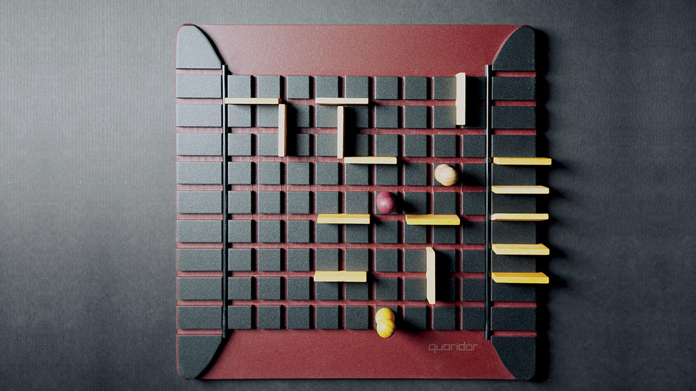

# Desempeño y búsqueda de políticas de agente Reinforcement Learning en Quoridor

### DYBPARLQ

## 

### Integrantes: Pablo Gomez

## Introducción

Quoridor es un juego de estrategia competitivo de 2 a 4 jugadores en el que el objetivo es, dadas 10 vallas
inicialmente, para llevar tu peón al lado opuesto del tablero antes que el oponente correspondiente.
Este estudio estará específicamente enfocado en el juego de 2 jugadores en tableros de 5x5 y 9x9. Por turno, cada el jugador puede elegir colocar una valla (si queda alguna) o su peón solo en una unidad horizontal o verticalmente, excepto en los siguientes casos

    (1) Cuando 2 jugadores se enfrentan en cuadrados adyacentes no separados por una valla, lo que permite saltos.
    (2) Si una valla está detrás de otro peón, el jugador puede colocar su peón a la izquierda o derecha del peón del oponente.

## Justificación

A pesar del conjunto de reglas relativamente simplista, Quoridor es un juego desafiante ya que:

    i- El mecanismo de las paredes aporta aleatoriedad al proceso, lo que dificulta el funcionamiento de algoritmo de arboles de busqueda de fuerza bruta. 
    ii- La complejidad del espacio crece exponencialmente respecto a los jugadores.
    iii- Introduce un entorno de aprendizaje novedoso que aún no se ha resuelto en la comunidad de reinforcement learning(RL).
    iv- Falta de heurística directa. 

## Objetivos

Así, el objetivo central de este proyecto es analizar el desempeño de un agente RL e identificar factores discretos que contribuyen a la predicción óptima de políticas. Para esto, se comparará la performance del agente RL contrastandolo con un agente determinístico. En principio el agente utilizará técnicas de Q-learning, pero no se descarta buscar otras potenciales soluciones.

### **Explicación de la estrategia del agente determinístico**

El agente determinístico buscará avanzar hacia el objetivo moviendose hacia adelante a menos que se le bloquee el camino con una pared, en tal caso antes de moverse hacia alguno de los costados para esquivar la pared(la dirección horizontal se eligirá de manera aleatoria), buscará bloquear al peón contrario ubicandole primero paredes en los costados(de manera vertical), calculando la distancia que se podrá mover el contricante antes de pasar las paredes para atrapanr al peon contrario con paredes en forma de "U". Estas acciones las realizará siempre y cuando la distancia del peón contrario sea lo suficientemente lejana para poder armar la trampa en U, en caso contrario seguirá buscando moverse para avanzar hacia la meta.

## Alcance y limitaciones

Investigadores descubrieron que el factor de bifurcación en un juego como Quoridor era demasiado grande para producir una solución de terminal. En cambio, usaron una profundidad limitada para tratar de evaluar la utilidad de la posición del juego después de un cierto conjunto de movimientos en un futuro cercano. Si bien el agente no pudo jugar tan bien como un humano, proporcionó una buena base para el trabajo futuro.

## Metricas

    - Movimientos en dirección al objetivo/meta
    - Porcentaje de juegos ganados

En principio los movimientos laterales y posicionamiento de paredes no sumarian ni restarían a la medida de performance, y los movimientos en dirección contraria al objetivo restarían 

## Listado de actividades a realizar

    1-  Búsqueda y lectura de bibliografía de Reinforcement Learning. [7-10 días]
    2-  Planteo de la posible solución. [2-3 días]
    3-  Codificación del entorno y el agente determinítico. [7-10 días]
    4-  Codificación del agente RL. [5-7 días]
    5-  Recopilación de datos de las simulaciones. [2 días]
    6-  Analisis de los datos obtenidos. [2-3 días]
    7-  Desarrollo del informe del proyecto. [4 días]

## Referencias

AIMA 3ra edición
Quoridor-AI - Chris Jose, Sakshum Kulshrestha, Chenyi Ling, Xiaoyur Liu, Ben Moskowitz
Monte Carlo Tree Search for Quoridor - Victor Massagué Respall, Joseph Alexander Brown, Hamna Aslam
