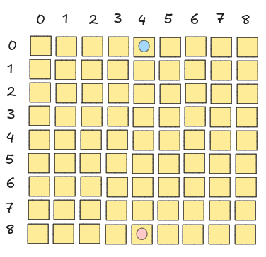
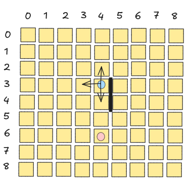
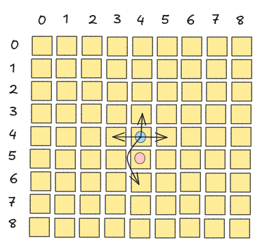
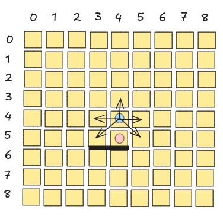
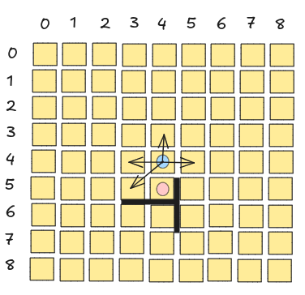
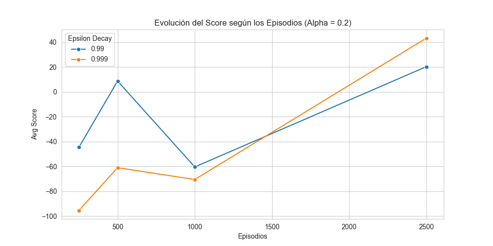

# Desempeño y Búsqueda de Políticas de Agente Reinforcement Learning en Quoridor(DYBPARLQ)

## Introducción

El desarrollo de agentes inteligentes para juegos estratégicos ha sido un tema central en el campo de la inteligencia artificial. Este trabajo se centra en el uso del aprendizaje por refuerzo (Reinforcement Learning, RL), una rama de aprendizaje automático en la que un agente interactúa con un entorno para maximizar una recompensa acumulada.

Quoridor se presenta como un desafío estratégico de gran interés en el ámbito de los juegos de tablero, al combinar la planificación a largo plazo con la adaptación a las acciones del oponente. En este proyecto, el aprendizaje por refuerzo se utiliza para explorar cómo un agente puede aprender a navegar un espacio de estados dinámico, empleando representaciones eficientes del tablero, estrategias de movimiento y colocación de barreras.

Este trabajo se centra en el diseño, implementación y análisis de dos tipos de agentes para el juego Quoridor: un agente determinista, basado en reglas predefinidas, y un agente adaptativo, entrenado mediante Q-learning, un algoritmo de aprendizaje por refuerzo.

El agente adaptativo será evaluado en partidas automáticas contra un agente determinista, cuyo comportamiento está basado en un conjunto fijo de reglas, como avanzar prioritariamente hacia la meta y bloquear estratégicamente al oponente mediante la colocación de barreras. Esta comparación permitirá analizar las diferencias en desempeño entre un enfoque basado en aprendizaje por refuerzo y otro basado en reglas fijas, destacando las ventajas de un agente que aprende y se adapta dinámicamente.

Este informe describe el desarrollo del proyecto en cinco secciones principales: el marco teórico, que aborda los fundamentos conceptuales del aprendizaje por refuerzo y su aplicación en Quoridor; el diseño experimental, donde se detalla la implementación de los agentes y las métricas de evaluación; el análisis y discusión de resultados, que interpreta los hallazgos obtenidos durante las pruebas; y las conclusiones, que sintetizan los aprendizajes y plantean posibles líneas futuras de trabajo.

## Marco Teórico 

Quoridor es un juego de tablero que plantea desafíos estratégicos y tácticos. Los jugadores deben avanzar hacia su objetivo mientras colocan barreras para dificultar el progreso del oponente, garantizando siempre un camino accesible hacia la meta. Esta combinación de planificación ofensiva y defensiva convierte a Quoridor en un entorno ideal para estudiar agentes inteligentes que toman decisiones en tiempo real.

#### Reglas de Quoridor

Quoridor es un juego de mesa en el que el objetivo es llegar a la fila opuesta del tablero antes que tu oponente, evitando que el contrincante llegue a su objetivo colocando obstáculos. El juego está compuesto por el tablero que está formado por una cuadrícula de 9x9 casillas, 2 peones(uno para cada jugador) y 20 muros o barreras(10 para cada jugador)

##### Preparación:
Cada jugador coloca su peón en la casilla central de su fila inicial (la fila más cercana a él). Cada jugador recibe 10 muros.

##### Turnos:

Los jugadores se turnan para jugar. En su turno, un jugador puede hacer una de las siguientes acciones:

1- Mover su peón: El peón puede moverse a una casilla adyacente en dirección ortogonal (arriba, abajo, izquierda o derecha), siempre que no haya un muro bloqueando el paso.

2- Colocar un muro: Se puede colocar un muro entre dos casillas para bloquear el paso del oponente. Los muros deben colocarse entre dos intersecciones de líneas y no pueden dividir el tablero en dos partes completamente aisladas.

##### Reglas adicionales:

* Si un peón está adyacente al peón del oponente y no hay un muro entre ellos, puede saltarlo y ocupar su casilla.

* Si hay un muro detrás del peón del oponente, se puede mover en dirección lateral o diagonal.  

* No se pueden recuperar muros una vez colocados.

El juego termina cuando un jugador alcanza la fila opuesta con su peón y se le declara ganador.

#### Aprendizaje por Refuerzo

El aprendizaje por refuerzo se basa en la interacción entre un agente y un entorno. El agente observa el estado del entorno, ejecuta una acción, recibe una recompensa y transita hacia un nuevo estado. El objetivo del agente es aprender una política que maximice la recompensa acumulada a lo largo del tiempo. La política puede ser una función determinista o probabilística que asocia estados con acciones.

Un concepto central en RL es la función de valor, que estima la recompensa esperada para un estado o una combinación estado-acción. En este trabajo, se utiliza el algoritmo Q-learning, que aproxima la función de valor óptima (𝑄\*) sin requerir un modelo explícito del entorno. Este algoritmo utiliza una estructura conocida como Q-table para almacenar los valores Q y actualizarlos mediante la fórmula:

    𝑄(𝑠,𝑎) ← 𝑄(𝑠,𝑎) \+ 𝛼 \[𝑟 \+ 𝛾max\~𝑎′\~ 𝑄(𝑠′,𝑎′) − 𝑄(𝑠,𝑎)\]

Donde:

*  𝑠 y 𝑠′ son el estado actual y el siguiente.  
*  𝑎 y 𝑎′ son las acciones actuales y futuras.  
*  𝑟 es la recompensa recibida.  
*  𝛼 es la tasa de aprendizaje.  
*  𝛾 es el factor de descuento.

#### Importancia del Aprendizaje por Refuerzo en Juegos de Mesa

El aprendizaje por refuerzo (RL) ha sido fundamental en la resolución de juegos de mesa clásicos, permitiendo a las máquinas aprender estrategias complejas sin conocimiento previo explícito del dominio. Ejemplos destacados incluyen AlphaGo, que superó a jugadores profesionales de Go utilizando una combinación de RL y redes neuronales profundas, y AlphaZero, que demostró una capacidad sobresaliente en ajedrez, shogi(un juego japonés parecido al ajedrez) y GO, partiendo solo de reglas básicas y autoaprendizaje.

La aplicación de RL en Quoridor representa un desafío similar, ya que involucra la planificación estratégica y la adaptación a las decisiones del oponente. A diferencia de juegos como el ajedrez, donde las piezas tienen reglas de movimiento fijas, Quoridor introduce barreras que pueden modificar el espacio de juego en cada turno, lo que aumenta la complejidad del aprendizaje.

#### Comparación con Otros Métodos

Aunque este trabajo emplea Q-learning, otros enfoques, como el **Monte Carlo Tree Search (MCTS)**, han sido explorados previamente en Quoridor debido a su capacidad para evaluar de forma eficiente múltiples secuencias de movimientos. Sin embargo, el MCTS es computacionalmente intensivo y requiere un modelo explícito del juego, lo que lo hace menos adecuado para entrenar agentes adaptativos en un entorno dinámico. En contraste, Q-learning permite a los agentes aprender directamente de la interacción con el entorno, adaptándose al comportamiento del oponente y a reglas modificadas.

En problemas de mayor complejidad, como juegos con grandes espacios de estado, se podrían utilizar técnicas más avanzadas, como Deep Q-Networks (DQN). En el caso de Quoridor, el número de estados posibles es extremadamente grande debido a la combinación de posiciones de los jugadores y las barreras colocadas. Esto hace que una Q-table tradicional sea difícil de manejar, pues requiere almacenar una cantidad masiva de combinaciones de estados y acciones.Para abordar el problema del espacio de estado demasiado grande, Deep Q-Networks (DQN) reemplaza la Q-table con una red neuronal que aproxima la función Q(s,a). En lugar de almacenar valores explícitos en una tabla, la red neuronal aprende a predecir la mejor acción en función de las características del estado.

Si bien en este trabajo se ha optado por Q-learning debido a su simplicidad y menor costo computacional, un enfoque basado en DQN podría ser más adecuado para un agente que juegue Quoridor de manera óptima. Esto se debe a que:

* La representación explícita de todos los estados en una tabla es impracticable en Quoridor debido al gran espacio de búsqueda.  
* Una red neuronal podría aprender patrones generales del juego sin necesidad de almacenar cada estado individualmente.  
* DQN permitiría la generalización en tableros de diferentes tamaños o contra distintos tipos de oponentes.

#### Relevancia del Aprendizaje por Refuerzo en Quoridor

La naturaleza secuencial y competitiva de Quoridor lo convierte en un entorno ideal para investigar el balance entre exploración y explotación, el diseño de recompensas, y la representación eficiente de estados y acciones. Además, las adaptaciones introducidas en este proyecto, como el sistema de puntuación y los tableros de diferentes tamaños, permiten evaluar cómo la complejidad del entorno afecta el aprendizaje y la estrategia del agente.

## Diseño Experimental

Para poner a prueba el algoritmo de Q-learning aplicado al entorno de quoridor se tiene que tener en cuenta por un lado la manera en la que se va a recompensar o penalizar al agente por cada acción que tome según el estado en el que se encuentre, y por el otro lado hacer un proceso se sintonización o tuning de los hiper-parámetros del algoritmo, es decir, se van a ajustar los distintos parámetros del algoritmo de q-learning(alpha, gamma, epsilon), como así también considerar que factor de descuento de la tasa de exploración(epsilon decay) tras cada episodio para buscar el mejor rendimiento en el problema de Quoridor, ya que al haber un espacio de acciones tan grande, si bien hay que fomentar la exploración del agente, a medida que avanza el aprendizaje hay que disminuir paulatinamente este parámetro para explotar las mejores acciones conocidas. Otro factor que hay que tener en cuenta es el entorno en el que se va a realizar esta sintonización, si bien el tablero original en el que se evalúa el agente es de 9x9, se pueden reducir los tiempos de este proceso llevándolo a cabo en el entorno de 5x5 debido al gran tiempo de cómputo que requieren las simulaciones.

Una vez obtenidos los datos de las simulaciones con las distintas combinaciones de parámetros, se procederá a utilizar librerías de python para graficar los resultados y así poder visualizar de mejor manera la forma en la que varía el desempeño del agente con las variantes probadas. Este proceso se repetirá las veces que sea necesario para poder ajustar lo mejor posible la configuración del agente.

### Aplicación del Aprendizaje por Refuerzo en Quoridor

En el juego de Quoridor, el entorno está representado por el tablero de 9x9 casillas. En este proyecto, se trabajan dos variantes del juego: un tablero estándar de 9x9 casillas y una versión simplificada de 5x5. El uso de un tablero más pequeño facilita la exploración y entrenamiento inicial del agente basado en Q-learning, permitiendo un análisis comparativo del impacto de la complejidad del entorno en el desempeño de los agentes.

Además, se introducen modificaciones como un sistema de puntuación basado en el progreso hacia la meta y la colocación de barreras. Estas reglas adaptadas permiten evaluar de forma más granular las estrategias y decisiones tomadas por los agentes.

En este contexto los estados encapsulan información sobre las posiciones de los peones, las barreras colocadas y las barreras restantes de cada jugador. Las acciones disponibles incluyen mover el peón a una casilla válida (horizontal, vertical o mediante saltos) y colocar barreras en ubicaciones permitidas. El objetivo del agente es llegar a la fila opuesta o maximizar su puntaje siguiendo el esquema adaptado.

La recompensa se diseña para reflejar el progreso estratégico, el primer diseño que se le da a la política de recompensas del agente es la siguiente:

    1- Movimientos hacia la meta: Otorgan recompensas crecientes (2^n, según la fila alcanzada).

    2- Movimientos en sentido opuesto: Se penaliza con 2^n, siguiendo el mismo criterio.

    3- Movimientos laterales: Penaliza de manera progresiva con 2*n°_turno.

    4- Colocación de barreras: En un principio se penalizará con 10 * tamaño_del_entorno si la barrera no bloquea la columna por la que avanza el oponente, y recompensará con tamaño_del _entorno² si lo hace.

Este diseño recompensa las acciones que acercan al agente a su objetivo, penaliza movimientos regresivos, aumenta la penalización de movimientos laterales a medida que avanza el juego para evitar que quede encerrado en trampas en forma de U e intenta incentivar el uso de barreras horizontales para evitar que el oponente llegue a la meta. Este diseño simple se aplica en un principio por la dificultad que conlleva crear políticas ideales que lleven al agente a jugar de manera óptima. Finalmente, si bien cada agente empieza la partida siempre en el mismo lado del tablero, se aleatoriza que peón empieza jugando de manera aleatoria, teniendo cada agente 50% de probabilidades de comenzar jugando.

#### Elección de los Hiperparámetros de Q-learning

El entrenamiento requiere ajustes en:

* Tasa de aprendizaje (alpha): Determina cuánta información nueva se incorpora en cada iteración.  
    
* Factor de descuento (gamma): Controla cuánta importancia se da a las recompensas futuras.  
    
* Epsilon (exploración vs. explotación): Define la probabilidad de elegir una acción aleatoria en lugar de la mejor conocida.  
    
* Epsilon decay: Reduce gradualmente el epsilon a medida que el agente aprende.  
    
* Episodios: Una mayor cantidad de episodios le permitirá al agente explorar el espacio de acciones para encontrar aquellas que lo acercan más a su objetivo.

#### Exploración vs. Explotación en el Aprendizaje por Refuerzo

Uno de los desafíos fundamentales en el aprendizaje por refuerzo es el equilibrio entre exploración y explotación. Este dilema surge porque el agente debe decidir constantemente entre:

**Explotación**: Elegir la mejor acción conocida hasta el momento para maximizar la recompensa inmediata.  
**Exploración**: Probar nuevas acciones para descubrir estrategias potencialmente mejores a largo plazo.

En el contexto de Quoridor, la explotación significaría que el agente selecciona siempre el movimiento con la mejor recompensa esperada según su Q-table. Sin embargo, si el agente explota demasiado temprano, puede quedar atrapado en estrategias subóptimas sin descubrir mejores caminos para ganar la partida.

Por otro lado, la exploración implica tomar decisiones que pueden parecer inicialmente malas (como colocar barreras en posiciones poco intuitivas) con la esperanza de descubrir patrones estratégicos más efectivos a largo plazo. Un agente que explora demasiado puede desperdiciar movimientos y aprender más lentamente, pero también puede encontrar soluciones más óptimas con el tiempo.

##### Métodos de Exploración en Q-learning

Para gestionar este equilibrio, existen diversas estrategias de exploración:

**ε-greedy**: Se elige la mejor acción conocida con probabilidad 1−ε, y una acción aleatoria con probabilidad ε disminuye progresivamente para explorar más al inicio y explotar en etapas avanzadas.

**Softmax**: Las acciones se eligen de forma probabilística según sus valores Q(s,a), permitiendo que incluso las opciones subóptimas sean seleccionadas ocasionalmente.

**Métodos basados en incertidumbre (UCB, Bayesian Methods)**: Favorecen acciones menos exploradas, enfocándose en reducir la incertidumbre en lugar de maximizar recompensas inmediatas.

##### Justificación del Uso de ε-greedy en Quoridor

La elección de ε-greedy para este proyecto se basa en los siguientes factores:

1. Facilidad de implementación: Es un enfoque simple y efectivo que no requiere cálculos adicionales de probabilidades o modelos de incertidumbre.  
2. Adecuación a un espacio de acciones discreto: En Quoridor, las acciones (moverse o colocar barreras) son discretas y finitas, lo que hace que este método sea eficiente.  
3. Balance dinámico entre exploración y explotación: Al decrecer ε con el tiempo, el agente puede explorar al inicio y explotar estrategias aprendidas en etapas posteriores del entrenamiento.  
4. Evita el estancamiento en estrategias locales subóptimas: La introducción de exploración aleatoria permite que el agente descubra mejores estrategias en tableros con configuraciones variadas.

Dado que el objetivo es que el agente aprenda estrategias ganadoras sin quedar atrapado en soluciones mediocres, ε-greedy proporciona una forma práctica de permitir exploración en las primeras etapas del aprendizaje y favorecer la explotación conforme el agente se vuelve más experto en el juego.

#### Desafíos de Convergencia de Q-learning en Espacios de Estado Grandes

Uno de los principales desafíos en el uso de Q-learning es garantizar su convergencia cuando se enfrenta a espacios de estados grandes y complejos, como el tablero de Quoridor. A medida que el número de estados crece exponencialmente con el tamaño del tablero y la cantidad de barreras colocadas, la tabla Q(s,a) se vuelve difícil de almacenar y actualizar eficientemente. Esto no solo ralentiza el aprendizaje, sino que también incrementa el riesgo de que el agente no logre explorar suficientemente el espacio de soluciones, afectando su capacidad para encontrar estrategias óptimas, por lo que nos encontramos con los siguientes desafíos:

1\. Dimensionalidad del Espacio de Estados

En Quoridor, un estado está definido por:

* La posición de ambos jugadores.  
* La cantidad y ubicación de las barreras en el tablero.

Esto genera un número exponencialmente creciente de posibles configuraciones. En problemas con espacios de estado enormes, almacenar y actualizar una tabla Q(s,a) explícita se vuelve inviable tanto en términos de memoria como de tiempo de cómputo.

2\. Convergencia Lenta

El aprendizaje en Q-learning requiere visitar múltiples veces cada estado y acción para estimar correctamente sus valores Q(s,a). Sin embargo, en espacios de estado grandes:

* Muchos estados pueden no visitarse con suficiente frecuencia, retrasando la convergencia.  
* Pequeños errores en la actualización de Q pueden propagarse y afectar decisiones futuras.  
* La exploración puede ser ineficiente si no se aplican estrategias bien diseñadas, como epsilon decay.

3\. Problema de Generalización

Q-learning estándar no generaliza entre estados similares. Cada estado se trata de manera independiente, lo que significa que incluso si dos estados son casi idénticos, sus valores  Q(s,a) se aprenden por separado. Por ejemplo, si el agente ha aprendido que bloquear el camino del oponente en una posición específica es útil, este conocimiento no se transfiere automáticamente a otras configuraciones similares del tablero.

En este proyecto, Q-learning ha sido implementado de manera tradicional debido a su simplicidad, pero los desafíos mencionados han limitado su capacidad para encontrar estrategias óptimas en todos los escenarios.

#### El Agente Determinista

En contraste con el agente basado en Q-learning, el agente determinista sigue un conjunto de reglas predefinidas para tomar decisiones. Estas reglas incluyen:

* Avanzar hacia la meta siempre que sea posible.   
* Si se encuentra con una barrera, bloquear al oponente mediante la colocación de barreras en forma de "U".  
* Si no tiene barreras o el oponente ya está “atrapado”, realizará movimientos laterales hacia un lado aleatorio para intentar esquivar el obstáculo.  
* Si ninguna de las acciones anteriores son posibles, entonces retrocederá para evadir los obstáculos. 

Este enfoque ofrece un comportamiento predecible, y si bien sería posible diseñar un agente determinista que tenga un mejor desempeño que este, la simplicidad de su implementación y secuencia de acciones para desenvolverse en el entorno sirve como referencia para evaluar el desempeño del agente adaptativo.

### Ajuste de Hiperparámetros para el Aprendizaje del Agente

Para buscar los valores óptimos a utilizar, se va a proceder a hacer un barrido de parámetros que permitan un balance entre la exploración y explotación de las secuencias de acciones posibles y así evitar caer en estados subóptimos. Para esto se van a tomar las siguientes consideraciones:

* Tomar valores pequeños de alpha, entre 0,01 y 0,2 para no darle tanto peso a las primeras exploraciones del agente, y de esta manera mejorar su desempeño mientras más episodios de entrenamiento realice.  
* Se va a tomar un solo valor de gamma relativamente alto(de 0,9), ya que lo que se busca es que al momento de elegir la acción, los estados futuros tengan un peso significativo, además al tomar un sólo valor reduce la cantidad de combinaciones para las configuraciones de parámetros posibles lo que a su vez reduce el tiempo de cómputo.  
* Como al principio del entrenamiento, el agente no tiene ninguna información sobre el entorno, se va a utilizar un valor de epsilon de 1,0, para que comience explorando la mayor cantidad de estados posibles antes de empezar a explotar las mejores acciones conocidas.  
* A su vez se van a probar dos valores para el factor de descuento de epsilon(epsilon decay), uno de 0,99 y otro de 0,999. Estos valores hacen que al agente le lleve más episodios de entrenamiento reducir su tasa de exploración, permitiendo expandir su conocimiento del entorno.  
* Además teniendo en cuenta los valores de epsilon y epsilon decay, se calculó cuántos episodios se necesitan para que el valor de epsilon sea prácticamente nulo, comenzando con un epsilon de 1,0 en ambos casos, para un epsilon decay de 0,99 tomaría solo 230 episodios para que la tasa de exploración alcance el valor de aproximadamente 0,1, mientras que para el epsilon decay de 0,999 se necesitan 2300 episodios para alcanzar un valor similar, por lo que se limitará el epsilon mínimo a 0,1 para que con ambas configuraciones se mantenga una probabilidad de exploración de al menos el 10%.  
* También se recopilaran los datos de estas configuraciones para distinta cantidad de episodios para luego analizar el aprendizaje del agente. Los valores que se utilizarán serán de 250, 500, 1000 y 2500\.

Cómo se mencionó anteriormente, estas pruebas se realizarán primero en el entorno reducido de 5x5, ya que son partidas más cortas, con un menor espacio de acciones y en consecuencia menor tiempo de cómputo, y para evitar que las partidas se extiendan demasiado por posibles complicaciones de los agentes para superar obstáculos, se limitará la cantidad máxima de turnos en 100 para este entorno, y luego según los resultados obtenidos se analizará qué valores utilizar en el entorno original. Finalmente se correrán 100 pruebas de cada configuración después del entrenamiento para tomar métricas más fiables y evitar resultados estocásticos.

### Evaluación del Agente en el Entorno Original

Tras analizar los resultados obtenidos en el entorno reducido de 5x5, se decidió evaluar el desempeño del agente en el entorno original de Quoridor (9x9) utilizando las configuraciones más prometedoras. Dado que la expansión del espacio de estados y de acciones introduce una mayor complejidad en el aprendizaje, se ajustaron los hiperparámetros para favorecer una exploración inicial más amplia y permitir una adaptación progresiva.

#### Consideraciones para el Entorno 9x9

Dado que en el entorno de 5x5 el agente mostró mejor desempeño cuando la tasa de exploración disminuía de manera más progresiva, se priorizó el uso de **Epsilon Decay \= 0.999** en el entorno 9x9. Este ajuste busca evitar que el agente se estanque prematuramente en estrategias subóptimas y pueda seguir explorando de manera efectiva en un espacio de acción más amplio.

Asimismo, los mejores resultados en tasa de victorias en el entorno 5x5 se obtuvieron con Alpha = 0.2 y una cantidad intermedia de episodios. Sin embargo, debido al aumento de complejidad en 9x9, se evaluarán tanto valores de Alpha = 0.1 como Alpha \= 0.2 para determinar cuál permite una mejor convergencia en el aprendizaje.

Otro factor clave observado en 5x5 fue la relación entre episodios de entrenamiento y rendimiento. Aunque en algunos casos 500 episodios fueron suficientes para lograr una tasa de victorias alta, en configuraciones con mayor Epsilon Decay se requirió un mayor número de episodios para consolidar estrategias. Por lo tanto, en 9x9 se probarán configuraciones con 1000, 2500 y 5000 episodios para evaluar cómo la cantidad de entrenamiento impacta en el rendimiento.

## Análisis de Resultados

El siguiente análisis tiene como objetivo evaluar el desempeño del agente Q-learning primeramente en el entorno de Quoridor de 5x5 bajo distintas configuraciones de hiperparámetros. Para ello, se han realizado simulaciones variando valores clave como la tasa de aprendizaje (α), el factor de descuento (γ), la exploración inicial (ε), la tasa de decaimiento de ε y la cantidad de episodios de entrenamiento.

### Resultados del Barrido de Parámetros en el Entorno Reducido

| Alpha | Gamma | Epsilon | Epsilon Decay | Episodes | Tests Qty | Win Rate | Avg Score | Avg Barriers Placed |
| :---- | :---- | :---- | :---- | :---- | :---- | :---- | :---- | :---- |
| 0.1 | 0.9 | 1.0 | 0.99 | 250 | 100 | 2.0 | \-31.53 | 3.0 |
| 0.1 | 0.9 | 1.0 | 0.99 | 500 | 100 | 12.0 | 11.49 | 2.53 |
| 0.1 | 0.9 | 1.0 | 0.99 | 1000 | 100 | 1.0 | 34.64 | 2.54 |
| 0.1 | 0.9 | 1.0 | 0.99 | 2500 | 100 | 0.0 | 37.49 | 2.22 |
| 0.1 | 0.9 | 1.0 | 0.999 | 250 | 100 | 7.0 | \-136.49 | 2.93 |
| 0.1 | 0.9 | 1.0 | 0.999 | 500 | 100 | 3.0 | \-64.12 | 2.77 |
| 0.1 | 0.9 | 1.0 | 0.999 | 1000 | 100 | 1.0 | \-41.14 | 2.93 |
| 0.1 | 0.9 | 1.0 | 0.999 | 2500 | 100 | 0.0 | 43.52 | 2.19 |
| 0.2 | 0.9 | 1.0 | 0.99 | 250 | 100 | 1.0 | \-44.44 | 2.96 |
| 0.2 | 0.9 | 1.0 | 0.99 | 500 | 100 | 39.0 | 8.78 | 2.96 |
| 0.2 | 0.9 | 1.0 | 0.99 | 1000 | 100 | 3.0 | \-60.37 | 2.99 |
| 0.2 | 0.9 | 1.0 | 0.99 | 2500 | 100 | 35.0 | 20.33 | 3.0 |
| 0.2 | 0.9 | 1.0 | 0.999 | 250 | 100 | 3.0 | \-95.27 | 2.87 |
| 0.2 | 0.9 | 1.0 | 0.999 | 500 | 100 | 4.0 | \-60.95 | 2.68 |
| 0.2 | 0.9 | 1.0 | 0.999 | 1000 | 100 | 9.0 | \-70.45 | 2.97 |
| 0.2 | 0.9 | 1.0 | 0.999 | 2500 | 100 | 1.0 | 43.3 | 2.77 |

***Imagen 1: Variación del puntaje promedio con alpha = 0.1 para distintos valores de epsilon decay en el entorno reducido(5x5).***

***Imagen 2: Variación del puntaje promedio con alpha = 0.2 para distintos valores de epsilon decay en el entorno reducido(5x5).***

#### Exploración vs. Explotación

Cuando Epsilon Decay es 0.99, el agente sigue explorando más durante el entrenamiento, sin embargo, no siempre conduce a un mejor desempeño final. En cambio, cuando Epsilon Decay es 0.999, la exploración disminuye más lentamente, permitiendo consolidar estrategias aprendidas.  
En general, un mayor Epsilon Decay tiende a mostrar menor variabilidad en el rendimiento, lo que podría indicar un equilibrio más estable entre exploración y explotación.

#### Impacto de los Episodios en el Rendimiento

En configuraciones con 250 episodios, el agente muestra una baja tasa de victorias (Win Rate ≤ 7%), indicando que aún no ha aprendido una estrategia efectiva.  
A medida que aumentan los episodios (500, 1000, 2500), el desempeño varía, mostrando en algunos casos mejoras en el puntaje promedio y el uso de barreras, pero sin una tendencia clara de optimización.  
En ciertos casos (por ejemplo, Epsilon Decay \= 0.999, Episodes \= 2500), se observa que el agente logra puntajes positivos, sugiriendo que un mayor entrenamiento puede mejorar su rendimiento, sin embargo en otros casos (por ejemplo, Epsilon Decay \= 0.99 y Episodes \= 500\) consigue algunos de los mayores porcentajes de Win Rate(12% con Alpha \= 0.1 y 39% con Alpha \= 0.2) por lo que pareciera que mientras más alta es la tasa de aprendizaje en este entorno reducido y mayor el decaimiento de la tasa de exploración, con menor cantidad de episodios logra mayor tasa de victorias.

#### Comparación entre Configuraciones

* Mejor resultado en tasa de victorias:  
1. (α=0.2, γ=0.9, ε=1.0, Decay=0.99, Episodes=500) → 39% Win Rate, con un puntaje positivo (8.78).  
2. (α=0.2, γ=0.9, ε=1.0, Decay=0.99, Episodes=2500) → 35% Win Rate y 20.33 de puntaje.

En ambas configuraciones se alcanzó la cota inferior en la tasa de exploración, pero dado que el espacio de acciones en el entorno original es mayor, probablemente se necesite que la tasa de exploración disminuya más lento.

* Peores desempeños:

* Varias configuraciones muestran Win Rate \= 0%, lo que sugiere que el agente no logró encontrar estrategias efectivas en esos casos, aunque no habría que descartar aquellas en las que la tasa de exploración ya era baja y se consiguieron puntajes positivos(por ejemplo, α=0.1, Decay=0.99, Episodes=2500).  
* En configuraciones como (α=0.1, γ=0.9, ε=1.0, Decay=0.999, Episodes=1000), el puntaje promedio es negativo (-70.45), lo que indica que el agente sigue cometiendo errores importantes. Probablemente debido a que la tasa de exploración en esos casos es de aproximadamente del 37%. Por lo que para configuraciones con Decay=0.999 van a requerir mayor cantidad de episodios.

### Resultados del barrido de parámetros en el entorno original

Tras evaluar el desempeño del agente en el entorno 9x9 con Epsilon Decay \= 0.999 y distintos valores de Alpha (0.1 y 0.2), se observaron patrones clave en la evolución del aprendizaje y el rendimiento del agente.

| Alpha | Gamma | Epsilon | Epsilon\_Decay | Episodes | Tests\_qty | Win\_Rate | Avg\_Score | Avg\_Barriers\_Placed |
| :---- | :---- | :---- | :---- | :---- | :---- | :---- | :---- | :---- |
| 0.1 | 0.9 | 1.0 | 0.999 | 1000 | 100 | 0.0 | \-271.7 | 7.74 |
| 0.1 | 0.9 | 1.0 | 0.999 | 2500 | 100 | 0.0 | \-63.28 | 8.89 |
| 0.1 | 0.9 | 1.0 | 0.999 | 5000 | 100 | 1.0 | \-62.12 | 9.46 |
| 0.2 | 0.9 | 1.0 | 0.999 | 1000 | 100 | 1.0 | \-525.7 | 8.99 |
| 0.2 | 0.9 | 1.0 | 0.999 | 2500 | 100 | 0.0 | \-27.03 | 9.3 |
| 0.2 | 0.9 | 1.0 | 0.999 | 5000 | 100 | 1.0 | 84.45 | 8.35 |

***Imagen 3: Variación del puntaje promedio para distintos alphas según la cantidad de episodios de entrenamiento en el entorno original(9x9).***

#### Impacto de la cantidad de episodios

El número de episodios de entrenamiento tuvo una influencia significativa en el rendimiento del agente dentro del entorno 9x9. En particular, se observó que un menor número de episodios resultaba en un desempeño deficiente, mientras que un aumento progresivo en la cantidad de iteraciones permitió una mejora notable en la eficacia del agente.

En las pruebas realizadas con 1000 episodios, el agente presentó un rendimiento insatisfactorio en todas las configuraciones evaluadas. Para Alpha \= 0.1, el puntaje promedio (Avg\_Score) alcanzado fue de \-271.7, mientras que con Alpha \= 0.2 el desempeño fue aún peor, con un Avg\_Score de \-525.7. Además, en ambos casos, la tasa de victorias fue prácticamente nula, lo que indica que el agente no logró desarrollar estrategias efectivas en esta fase de entrenamiento.

Al incrementar la cantidad de episodios a 2500, se observó una mejora significativa en los resultados. Para Alpha \= 0.1, el Avg\_Score aumentó a \-63.28, aunque la tasa de victorias se mantuvo en 0%. Por otro lado, con Alpha \= 0.2, el agente evidenció una mejor adaptación al entorno, alcanzando un Avg\_Score de \-27.03, lo que sugiere que comenzó a desarrollar estrategias más eficientes.

***Imagen 4: Evolución del puntaje promedio cada 50 episodios de entrenamiento con alpha = 0.2 en el entorno original(9x9).***

El mejor rendimiento registrado se obtuvo con 5000 episodios, donde el agente mostró un progreso más sólido. En el caso de Alpha \= 0.1, el Avg\_Score se estabilizó en \-62.12, acompañado de una mínima mejora en la tasa de victorias, que alcanzó el 1%. Con Alpha \= 0.2, el desempeño mejoró aún más, logrando un Avg\_Score positivo de 84.45 y manteniendo una tasa de victorias del 1%.

Estos resultados demuestran que la cantidad de episodios de entrenamiento es un factor crítico en el entorno 9x9. A diferencia de lo observado en el entorno 5x5, donde algunas configuraciones lograban una tasa de victorias considerable con menos de 1000 episodios, en un espacio de mayor complejidad como 9x9 es necesario un entrenamiento prolongado para que el agente pueda refinar su estrategia de manera efectiva.

#### Comparación entre Alpha \= 0.1 y Alpha \= 0.2

El impacto de la tasa de aprendizaje (Alpha) en el desempeño del agente fue evidente a lo largo del entrenamiento, reflejándose en la evolución del Avg\_Score y en la capacidad del agente para mejorar su estrategia con el tiempo.

En el caso de Alpha \= 0.1, se observó una mejora progresiva en el Avg\_Score a medida que aumentaba la cantidad de episodios. Sin embargo, este progreso fue limitado, ya que, si bien los puntajes negativos se redujeron con más entrenamiento, la tasa de victorias permaneció prácticamente nula. Esto sugiere que el agente tuvo dificultades para consolidar estrategias ganadoras, posiblemente debido a una convergencia más lenta o a la persistencia de decisiones subóptimas a lo largo del entrenamiento.

Por otro lado, Alpha \= 0.2 permitió un aprendizaje más acelerado, obteniendo mejores resultados en un menor número de episodios. A pesar de que su rendimiento inicial en 1000 episodios fue inferior al de Alpha \= 0.1, con un Avg\_Score de \-525.7, su progreso a lo largo del entrenamiento fue más notable. En 5000 episodios, el agente logró un Avg\_Score positivo de 84.45, lo que indica que no solo exploró de manera más eficiente el entorno, sino que también pudo explotar estrategias más exitosas en fases avanzadas del entrenamiento. Sin embargo, es importante evaluar hasta qué punto un Alpha elevado sigue siendo ventajoso, ya que un valor excesivamente alto podría impedir la estabilidad en el aprendizaje.

## Conclusiones

Si bien el agente ha mostrado una mejora progresiva en las puntuaciones obtenidas a medida que se incrementa la cantidad de episodios de entrenamiento, este avance no se traduce en un aumento significativo en la tasa de victorias. Esto sugiere que, aunque el agente está aprendiendo estrategias más eficientes para moverse en el entorno 9x9, estas no necesariamente conducen a una mayor probabilidad de ganar.

El valor de Alpha = 0.2 ha demostrado ser más efectivo que Alpha = 0.1, permitiendo una mejor adaptación y alcanzando valores positivos de Avg_Score en 5000 episodios. Sin embargo, la baja tasa de victorias indica que la función de recompensa puede estar incentivando estrategias que optimizan la puntuación sin priorizar la victoria.

Otro aspecto relevante es el uso de barreras, que varía a lo largo del entrenamiento y sugiere que el agente modifica su estrategia con el tiempo. Esto plantea la posibilidad de que, con más episodios o un refinamiento en la política de exploración, el agente pueda desarrollar tácticas aún más sofisticadas.

Dado que el diseño actual de la función de recompensa podría estar influyendo en estos resultados, futuros experimentos podrían centrarse en ajustar estos parámetros. Modificaciones en la forma en que se recompensa el uso de barreras o el acercamiento a la victoria podrían ayudar a alinear mejor el aprendizaje del agente con el objetivo final de ganar partidas.

## Bibliografía

\[1\] Russell, S., & Norvig, P. (2010). Artificial Intelligence: A Modern Approach (3rd ed.). Pearson.

\[2\] Sutton, R. S., & Barto, A. G. (2018). Reinforcement Learning: An Introduction (2nd ed.). MIT Press.

\[3\] Lapan, M. (2018). Deep Reinforcement Learning Hands-On. Packt Publishing.

\[4\] Massagué Respall, V., Brown, J., & Aslam, H. (2018). Monte Carlo Tree Search for Quoridor. ResearchGate.

\[5\] Wang, H., Emmerich, M., & Plaat, A. (2019). Assessing the Potential of Classical Q-learning in General Game Playing. In Proceedings of the International Conference on Agents and Artificial Intelligence. ResearchGate.

\[6\] DataCamp. (n.d.). Introduction to Q-Learning: Beginner Tutorial. Retrieved from [https://www.datacamp.com/es/tutorial/introduction-q-learning-beginner-tutorial](https://www.datacamp.com/es/tutorial/introduction-q-learning-beginner-tutorial)

\[7\] Gymnasium. (n.d.). Train an Agent using Gymnasium. Retrieved from https://gymnasium.farama.org/