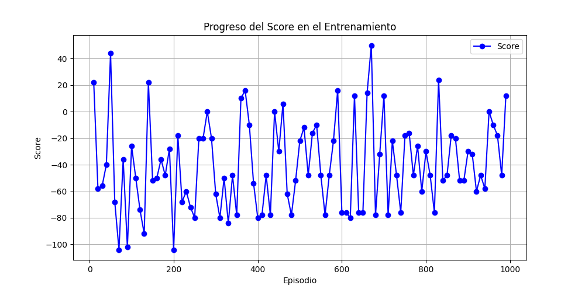
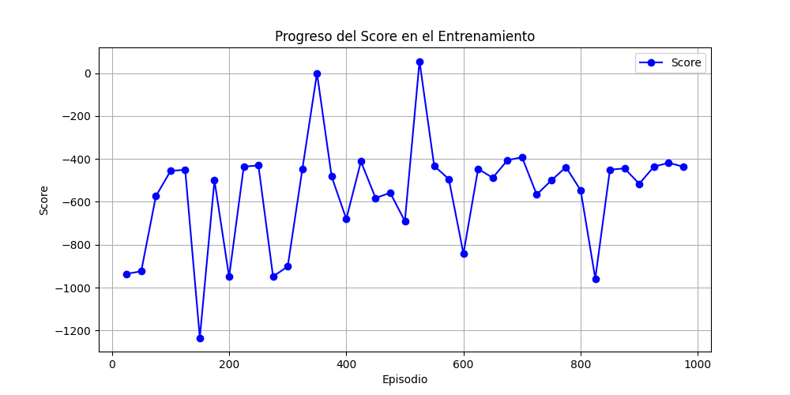
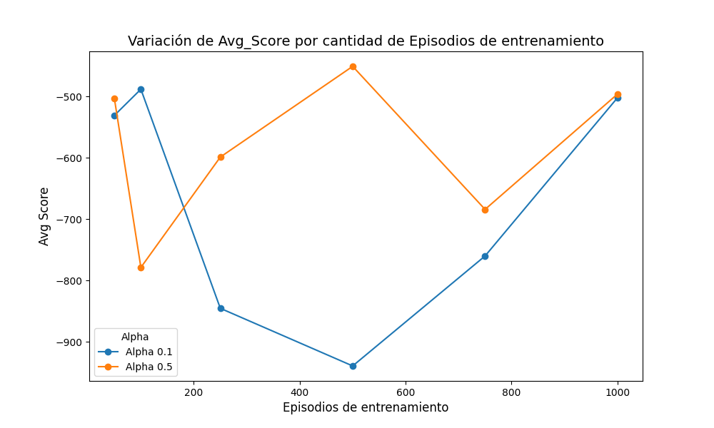
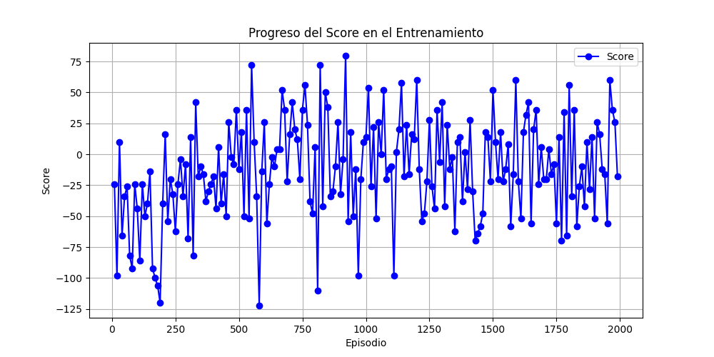
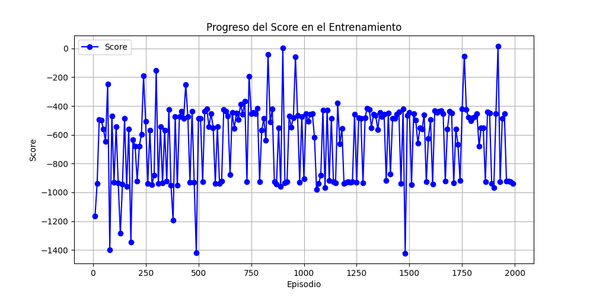

# Desempeño y Búsqueda de Políticas de Agente Reinforcement Learning en Quoridor(DYBPARLQ)

## Introducción
El desarrollo de agentes inteligentes para juegos estratégicos ha sido un tema central en el campo de la inteligencia artificial. Este trabajo se centra en el uso del aprendizaje por refuerzo (Reinforcement Learning, RL), una rama de aprendizaje automático en la que un agente interactúa con un entorno para maximizar una recompensa acumulada.

Quoridor se presenta como un desafío estratégico de gran interés en el ámbito de los juegos de tablero, al combinar la planificación a largo plazo con la adaptación a las acciones del oponente. En este proyecto, el aprendizaje por refuerzo se utiliza para explorar cómo un agente puede aprender a navegar un espacio de estados dinámico, empleando representaciones eficientes del tablero, estrategias de movimiento y colocación de barreras.

Este trabajo se centra en el diseño, implementación y análisis de dos tipos de agentes para el juego Quoridor: un agente determinista, basado en reglas predefinidas, y un agente adaptativo, entrenado mediante Q-learning, un algoritmo de aprendizaje por refuerzo.

Para evaluar de manera efectiva al agente basado en Q-learning, se introdujeron algunas modificaciones al juego original. Entre ellas, un sistema de puntuación y un límite de turnos, que permiten medir el desempeño en escenarios más controlados y facilitan el entrenamiento del agente.

El agente adaptativo será evaluado en partidas automáticas contra un agente determinista, cuyo comportamiento está basado en un conjunto fijo de reglas, como avanzar prioritariamente hacia la meta y bloquear estratégicamente al oponente mediante la colocación de barreras. Esta comparación permitirá analizar las diferencias en desempeño entre un enfoque basado en aprendizaje por refuerzo y otro basado en reglas fijas, destacando las ventajas de un agente que aprende y se adapta dinámicamente.

Este informe describe el desarrollo del proyecto en cinco secciones principales: el marco teórico, que aborda los fundamentos conceptuales del aprendizaje por refuerzo y su aplicación en Quoridor; el diseño experimental, donde se detalla la implementación de los agentes y las métricas de evaluación; el análisis y discusión de resultados, que interpreta los hallazgos obtenidos durante las pruebas; y las conclusiones, que sintetizan los aprendizajes y plantean posibles líneas futuras de trabajo.

## Marco Teórico 

Quoridor es un juego de tablero que plantea desafíos estratégicos y tácticos. Los jugadores deben avanzar hacia su objetivo mientras colocan barreras para dificultar el progreso del oponente, garantizando siempre un camino accesible hacia la meta. Esta combinación de planificación ofensiva y defensiva convierte a Quoridor en un entorno ideal para estudiar agentes inteligentes que toman decisiones en tiempo real.

### Reglas de Quoridor

Quoridor es un juego de mesa en el que el objetivo original es llegar a la fila opuesta del tablero antes que tu oponente, evitando que el contrincante llegue a su objetivo colocando obstáculos. El juego está compuesto por el tablero que está formado por una cuadrícula de 9x9 casillas, 2 peones(uno para cada jugador) y 20 muros o barreras(10 para cada jugador).

#### Preparación:
Cada jugador coloca su peón en la casilla central de su fila inicial (la fila más cercana a él). Cada jugador recibe 10 muros.

#### Turnos:
Los jugadores se turnan para jugar. En su turno, un jugador puede hacer una de las siguientes acciones:

1. Mover su peón: El peón puede moverse a una casilla adyacente en dirección ortogonal (arriba, abajo, izquierda o derecha), siempre que no haya un muro bloqueando el paso.
2. Colocar un muro: Se puede colocar un muro entre dos casillas para bloquear el paso del oponente. Los muros deben colocarse entre dos intersecciones de líneas y no pueden dividir el tablero en dos partes completamente aisladas.

#### Reglas adicionales:

* Si un peón está adyacente al peón del oponente y no hay un muro entre ellos, puede saltarlo y ocupar su casilla.
* Si hay un muro detrás del peón del oponente, se puede mover en dirección lateral.
* No se pueden recuperar muros una vez colocados.

El juego termina cuando un jugador alcanza la fila opuesta con su peón y se le declara ganador.

### Aprendizaje por Refuerzo
El aprendizaje por refuerzo se basa en la interacción entre un agente y un entorno. El agente observa el estado del entorno, ejecuta una acción, recibe una recompensa y transita hacia un nuevo estado. El objetivo del agente es aprender una política que maximice la recompensa acumulada a lo largo del tiempo. La política puede ser una función determinista o probabilística que asocia estados con acciones.

Un concepto central en RL es la función de valor, que estima la recompensa esperada para un estado o una combinación estado-acción. En este trabajo, se utiliza el algoritmo Q-learning, que aproxima la función de valor óptima (𝑄*) sin requerir un modelo explícito del entorno. Este algoritmo utiliza una estructura conocida como Q-table para almacenar los valores Q y actualizarlos mediante la fórmula:

    𝑄(𝑠,𝑎) ← 𝑄(𝑠,𝑎) + 𝛼 [𝑟 + 𝛾max~𝑎′~ 𝑄(𝑠′,𝑎′) − 𝑄(𝑠,𝑎)]

Donde:

* 𝑠 y 𝑠′ son el estado actual y el siguiente.

* 𝑎 y 𝑎′ son las acciones actuales y futuras.

* 𝑟 es la recompensa recibida.

* 𝛼 es la tasa de aprendizaje.

* 𝛾 es el factor de descuento.

### Importancia del Aprendizaje por Refuerzo en Juegos de Mesa

El aprendizaje por refuerzo (RL) ha sido fundamental en la resolución de juegos de mesa clásicos, permitiendo a las máquinas aprender estrategias complejas sin conocimiento previo explícito del dominio. Ejemplos destacados incluyen AlphaGo, que superó a jugadores profesionales de Go utilizando una combinación de RL y redes neuronales profundas, y AlphaZero, que demostró una capacidad sobresaliente en ajedrez, shogi(un juego japonés parecido al ajedrez) y GO, partiendo solo de reglas básicas y autoaprendizaje.

La aplicación de RL en Quoridor representa un desafío similar, ya que involucra la planificación estratégica y la adaptación a las decisiones del oponente. A diferencia de juegos como el ajedrez, donde las piezas tienen reglas de movimiento fijas, Quoridor introduce barreras que pueden modificar el espacio de juego en cada turno, lo que aumenta la complejidad del aprendizaje.

### Aplicación en Quoridor

En el juego de Quoridor, el entorno está representado por un tablero de 9x9 casillas. En este proyecto, se trabajan dos variantes del juego: un tablero estándar de 9x9 casillas y una versión simplificada de 5x5. El uso de un tablero más pequeño facilita la exploración y entrenamiento inicial del agente basado en Q-learning, permitiendo un análisis comparativo del impacto de la complejidad del entorno en el desempeño de los agentes.

Además, se introducen modificaciones como un sistema de puntuación basado en el progreso hacia la meta, la colocación de barreras y la cantidad de turnos disponibles. Estas reglas adaptadas permiten evaluar de forma más granular las estrategias y decisiones tomadas por los agentes.

En este contexto los estados encapsulan información sobre las posiciones de los peones, las barreras colocadas y las barreras restantes de cada jugador. Las acciones disponibles incluyen mover el peón a una casilla válida (horizontal, vertical o mediante saltos) y colocar barreras en ubicaciones permitidas. El objetivo del agente es llegar a la fila opuesta o maximizar su puntaje siguiendo el esquema adaptado.

La recompensa se diseña para reflejar el progreso estratégico:

    1- Movimientos hacia la meta: Otorgan recompensas crecientes (2^𝑛, según la fila alcanzada).

    2- Movimientos en sentido opuesto: Se penalizan con 2^𝑛, siguiendo el mismo criterio.

    3- Colocación de barreras: Reciben una recompensa fija positiva para incentivar el uso estratégico de este recurso.

Este diseño recompensa las acciones que acercan al agente a su objetivo, penaliza movimientos regresivos y fomenta el uso eficiente de las barreras.

### El Agente Determinista

En contraste con el agente basado en Q-learning, el agente determinista sigue un conjunto de reglas predefinidas para tomar decisiones. Estas reglas incluyen avanzar hacia la meta siempre que sea posible, bloquear estratégicamente al oponente mediante la colocación de barreras en forma de "U", y realizar movimientos laterales o retrocesos cuando las opciones anteriores no estén disponibles. Este enfoque ofrece un comportamiento predecible y sirve como referencia para evaluar el desempeño del agente adaptativo.

### Comparación de Enfoques

El enfrentamiento entre el agente determinista y el agente basado en Q-learning proporciona una base para analizar la eficacia de los enfoques basados en reglas frente a los adaptativos. Mientras que el agente determinista sigue estrategias fijas, el agente de Q-learning tiene la capacidad de ajustar su comportamiento a medida que aprende del entorno, lo que puede resultar en un desempeño superior en situaciones complejas o dinámicas.

#### Comparación con Otros Métodos

Aunque este trabajo emplea Q-learning, otros enfoques, como el **Monte Carlo Tree Search (MCTS)**, han sido explorados previamente en Quoridor debido a su capacidad para evaluar de forma eficiente múltiples secuencias de movimientos. Sin embargo, el MCTS es computacionalmente intensivo y requiere un modelo explícito del juego, lo que lo hace menos adecuado para entrenar agentes adaptativos en un entorno dinámico. En contraste, Q-learning permite a los agentes aprender directamente de la interacción con el entorno, adaptándose al comportamiento del oponente y a reglas modificadas.

En problemas de mayor complejidad, como juegos con grandes espacios de estado, se podrían utilizar técnicas más avanzadas, como Deep Q-Networks (DQN). En el caso de Quoridor, el número de estados posibles es extremadamente grande debido a la combinación de posiciones de los jugadores y las barreras colocadas. Esto hace que una Q-table tradicional sea difícil de manejar, pues requiere almacenar una cantidad masiva de combinaciones de estados y acciones.Para abordar el problema del espacio de estado demasiado grande, Deep Q-Networks (DQN) reemplaza la Q-table con una red neuronal que aproxima la función Q(s,a). En lugar de almacenar valores explícitos en una tabla, la red neuronal aprende a predecir la mejor acción en función de las características del estado.

Si bien en este trabajo se ha optado por Q-learning debido a su simplicidad y menor costo computacional, un enfoque basado en DQN podría ser más adecuado para un agente que juegue Quoridor de manera óptima. Esto se debe a que:

* La representación explícita de todos los estados en una tabla es impracticable en Quoridor debido al gran espacio de búsqueda.
* Una red neuronal podría aprender patrones generales del juego sin necesidad de almacenar cada estado individualmente.
* DQN permitiría la generalización en tableros de diferentes tamaños o contra distintos tipos de oponentes.

### Relevancia del Aprendizaje por Refuerzo en Quoridor

La naturaleza secuencial y competitiva de Quoridor lo convierte en un entorno ideal para investigar el balance entre exploración y explotación, el diseño de recompensas, y la representación eficiente de estados y acciones. Además, las adaptaciones introducidas en este proyecto, como el sistema de puntuación y los tableros de diferentes tamaños, permiten evaluar cómo la complejidad del entorno afecta el aprendizaje y la estrategia del agente.

### Exploración vs. Explotación en el Aprendizaje por Refuerzo
Uno de los desafíos fundamentales en el aprendizaje por refuerzo es el equilibrio entre exploración y explotación. Este dilema surge porque el agente debe decidir constantemente entre:

**Explotación**: Elegir la mejor acción conocida hasta el momento para maximizar la recompensa inmediata.
**Exploración**: Probar nuevas acciones para descubrir estrategias potencialmente mejores a largo plazo.

En el contexto de Quoridor, la explotación significaría que el agente selecciona siempre el movimiento con la mejor recompensa esperada según su Q-table. Sin embargo, si el agente explota demasiado temprano, puede quedar atrapado en estrategias subóptimas sin descubrir mejores caminos para ganar la partida.

Por otro lado, la exploración implica tomar decisiones que pueden parecer inicialmente malas (como colocar barreras en posiciones poco intuitivas) con la esperanza de descubrir patrones estratégicos más efectivos a largo plazo. Un agente que explora demasiado puede desperdiciar movimientos y aprender más lentamente, pero también puede encontrar soluciones más óptimas con el tiempo.

####  Métodos de Exploración en Q-learning
Para gestionar este equilibrio, existen diversas estrategias de exploración:

**ε-greedy**: Se elige la mejor acción conocida con probabilidad 1−ε, y una acción aleatoria con probabilidad ε disminuye progresivamente para explorar más al inicio y explotar en etapas avanzadas.

**Softmax**: Las acciones se eligen de forma probabilística según sus valores Q(s,a), permitiendo que incluso las opciones subóptimas sean seleccionadas ocasionalmente.

**Métodos basados en incertidumbre (UCB, Bayesian Methods)**: Favorecen acciones menos exploradas, enfocándose en reducir la incertidumbre en lugar de maximizar recompensas inmediatas.

##### Justificación del Uso de ε-greedy en Quoridor
La elección de ε-greedy para este proyecto se basa en los siguientes factores:

1. Facilidad de implementación: Es un enfoque simple y efectivo que no requiere cálculos adicionales de probabilidades o modelos de incertidumbre.
2. Adecuación a un espacio de acciones discreto: En Quoridor, las acciones (moverse o colocar barreras) son discretas y finitas, lo que hace que este método sea eficiente.
3. Balance dinámico entre exploración y explotación: Al decrecer ε con el tiempo, el agente puede explorar al inicio y explotar estrategias aprendidas en etapas posteriores del entrenamiento.
4. Evita el estancamiento en estrategias locales subóptimas: La introducción de exploración aleatoria permite que el agente descubra mejores estrategias en tableros con configuraciones variadas.

Dado que el objetivo es que el agente aprenda estrategias ganadoras sin quedar atrapado en soluciones mediocres, ε-greedy proporciona una forma práctica de permitir exploración en las primeras etapas del aprendizaje y favorecer la explotación conforme el agente se vuelve más experto en el juego.

### Desafíos de Convergencia de Q-learning en Espacios de Estado Grandes

Uno de los principales desafíos en el uso de Q-learning es garantizar su convergencia cuando se enfrenta a espacios de estados grandes y complejos, como el tablero de Quoridor. A medida que el número de estados crece exponencialmente con el tamaño del tablero y la cantidad de barreras colocadas, la tabla Q(s,a) se vuelve difícil de almacenar y actualizar eficientemente. Esto no solo ralentiza el aprendizaje, sino que también incrementa el riesgo de que el agente no logre explorar suficientemente el espacio de soluciones, afectando su capacidad para encontrar estrategias óptimas, por lo que nos encontramos con los siguientes desafíos:

1. Dimensionalidad del Espacio de Estados

En Quoridor, un estado está definido por:

* La posición de ambos jugadores.
* La cantidad y ubicación de las barreras en el tablero.

Esto genera un número exponencialmente creciente de posibles configuraciones. En problemas con espacios de estado enormes, almacenar y actualizar una tabla Q(s,a) explícita se vuelve inviable tanto en términos de memoria como de tiempo de cómputo.

2. Convergencia Lenta

El aprendizaje en Q-learning requiere visitar múltiples veces cada estado y acción para estimar correctamente sus valores Q(s,a). Sin embargo, en espacios de estado grandes:

* Muchos estados pueden no visitarse con suficiente frecuencia, retrasando la convergencia.
* Pequeños errores en la actualización de Q pueden propagarse y afectar decisiones futuras.
* La exploración puede ser ineficiente si no se aplican estrategias bien diseñadas, como epsilon decay.

3. Problema de Generalización

Q-learning estándar no generaliza entre estados similares. Cada estado se trata de manera independiente, lo que significa que incluso si dos estados son casi idénticos, sus valores  Q(s,a) se aprenden por separado. Por ejemplo, si el agente ha aprendido que bloquear el camino del oponente en una posición específica es útil, este conocimiento no se transfiere automáticamente a otras configuraciones similares del tablero.

En este proyecto, Q-learning ha sido implementado de manera tradicional debido a su simplicidad, pero los desafíos mencionados han limitado su capacidad para encontrar estrategias óptimas en todos los escenarios.

## Diseño Experimental

Para poner a prueba el algoritmo de Q-learning aplicado al entorno de quoridor se tiene que tener en cuenta por un lado la manera en la que se va a recompensar o penalizar al agente por cada acción que tome según el estado en el que se encuentre, y por el otro lado hacer un proceso se sintonización o tuning de los hiper-parámetros del algoritmo, es decir, se van a ajustar los distintos parámetros del algoritmo de q-learning(alpha, gamma, epsilon), como así también considerar que factor de descuento de la tasa de exploración(epsilon decay) tras cada episodio para buscar el mejor rendimiento en el problema de Quoridor, ya que al haber un espacio de acciones tan grande, si bien hay que fomentar la exploración del agente, a medida que avanza el aprendizaje hay que disminuir paulatinamente este parámetro para explotar las mejores acciones conocidas. Otro factor que hay que tener en cuenta es el entorno en el que se va a realizar esta sintonización, si bien el tablero original en el que se evalúa el agente es de 9x9, se pueden reducir los tiempos de este proceso llevándolo a cabo en el entorno de 5x5 debido al gran tiempo de cómputo que requieren las simulaciones.

Una vez obtenidos los datos de las simulaciones con las distintas combinaciones de parámetros, se procederá a utilizar librerías de python para graficar los resultados y así poder visualizar de mejor manera la forma en la que varía el desempeño del agente con las variantes probadas. Este proceso se repetirá las veces que sea necesario para poder ajustar lo mejor posible la configuración del agente.

### Elección de los Hiperparámetros de Q-learning

El entrenamiento requiere ajustes en:

* Tasa de aprendizaje (alpha): Determina cuánta información nueva se incorpora en cada iteración.

* Factor de descuento (gamma): Controla cuánta importancia se da a las recompensas futuras.

* Epsilon (exploración vs. explotación): Define la probabilidad de elegir una acción aleatoria en lugar de la mejor conocida.

* Epsilon decay: Reduce gradualmente el epsilon a medida que el agente aprende.

### Primer Enfoque

En un primer enfoque para encontrar los valores óptimos a utilizar, se buscó en trabajos realizados utilizando Q-learning aplicado a juegos(Gymnasium, DataCamp) para ver cómo se desempeña el agente en el entorno de Quoridor con esta configuración. Se probó en ambos escenarios, tanto en el tablero de 5x5 y 9x9 para ver si había diferencias significativas, donde se pudo apreciar rápidamente que en el entorno reducido se obtenían mejores resultados, y luego de varías simulaciones, se pudo deducir que esto ocurría porque el espacio de acciones en el entorno original era mucho mayor al entorno reducido, ya que contaba con más barreras para utilizar y más casilleros para posicionarlas.

En este primer enfoque se realizaron pruebas individuales, que no han sido las más adecuadas, ya que se podría hacer un análisis más completo y optimizar tiempos haciendo una barrido automático que abarque más variaciones de los parámetros. Si bien estos valores utilizados en las pruebas manuales no tenían un desempeño tan malo, este enfoque no podía asegurar un rendimiento óptimo, los valores que se utilizaron para los parámetros estaban probados en otro tipo de entorno, con otras reglas y un análisis de recompensas distinto al que se le estaba dando a el agente de Quoridor, por lo que se va armar un programa que pruebe más configuraciones para el agente de manera automática y así lograr un análisis más exhaustivo del rendimiento del algoritmo en los distintos escenarios.

### Segundo Enfoque

En este segundo enfoque se busca hacer un barrido más exhaustivo de los parámetros mencionados, buscando encontrar el rango de valores donde el agente tiene los mejores rendimientos para luego poder refinarlos, a continuación se detallan los valores que tendrán los mismos:

**alpha**: [0.01, 0.1, 0.5, 0.9]
**gamma**: [0.01, 0.1, 0.5, 0.9]
**epsilon**: [0.01, 0.1, 0.5, 0.9]
**epsilon-decay**: [0.99, 0.995]

y se tomaron distintos valores para los episodios a realizar en cada entrenamiento [500, 1000, 10000] para tener una primera aproximación del comportamiento del agente con estos parámetros, y ya que existe probabilidad de exploración aleatoria, con una misma configuración pueden haber resultados variables, es por eso que para reducir la variabilidad y mejorar la fiabilidad de los resultados se va a correr cada configuración 5 veces, aunque para tener resultados verdaderamente fiables requeriría de más iteraciones, en este primer experimento no se van a realizar más de 5 simulaciones por configuración debido al tiempo de cómputo de las mismas, luego en el entorno original de 9x9 ya teniendo los parámetros que funcionaron mejor en estas pruebas, se podrán hacer más simulaciones con las configuraciones con mejor rendimiento para obtener resultados más fiables.

### Tercer Enfoque

Debido a que la cantidad de combinaciones a probar en el segundo enfoque era de 384, y la simulación de cada una se iba a correr 5 veces, el total de simulaciones escalaba a 1920, además en las que la cantidad de episodios de entrenamiento eran de 10000 daba como resultado un tiempo considerablemente grande para los experimentos. Por lo dicho anteriormente se llegó a un tercer enfoque en el que los valores elegidos para correr los experimentos eran menos y más cerca de donde se habían dado los mejores resultados en los enfoques anteriores. Los siguientes valores a probar son:

**alpha**: [0.1, 0.2, 0.5]
**gamma**: [0.5, 0.9]
**epsilon**: [0.5, 0.9]
**epsilon-decay**: [0.99, 0.995]

y además, ya que las pruebas se harán en el entorno reducido donde el espacio de acciones es menor, se redujo la cantidad máxima de episodios a 2000.

### Consideraciones para el Entorno de 9x9
Dado que en el entorno de 5x5 el agente pudo alcanzar buenos puntajes con relativamente pocos episodios y una tasa de exploración moderada, es probable que en el entorno original (9x9) se requiera:

* Un Gamma más alto (0.9 o superior) para priorizar estrategias a largo plazo.
* Un Epsilon Decay más lento para permitir exploración en un espacio de estados más grande.
* Un número mayor de episodios para permitir la convergencia de la política de juego.

### Evaluación del Agente en el Entorno de 9x9

Tras analizar los resultados obtenidos en el entorno reducido de 5x5, se decidió evaluar el desempeño del agente en el entorno original de Quoridor (9x9) utilizando las configuraciones más prometedoras. Dado que la expansión del espacio de estados y de acciones introduce una mayor complejidad en el aprendizaje, se ajustaron los hiperparámetros para favorecer una exploración inicial más amplia y permitir una adaptación progresiva.

Los valores de los hiperparámetros seleccionados para esta evaluación son los siguientes:

* Alpha: Se probarán los valores 0.1 y 0.5, ya que en las simulaciones previas se observó que valores más altos de alpha aceleraban el aprendizaje en etapas iniciales, mientras que valores bajos permitían mayor estabilidad en la convergencia.  
* Gamma: Se establece en 0.9 debido a su capacidad de equilibrar la importancia de recompensas futuras y evitar un comportamiento excesivamente miope. En el entorno 9x9, la planificación a largo plazo es aún más crucial debido a la mayor cantidad de movimientos posibles antes de alcanzar una victoria o derrota.  
* Epsilon: Se fija en 1.0, lo que implica una exploración completa en las primeras etapas del entrenamiento. Esto es fundamental para permitir al agente descubrir estrategias viables en el entorno más amplio.  
* Epsilon Decay (tasa de disminución de epsilon): Se establece en 0.99 para garantizar una transición gradual entre la exploración y la explotación, evitando que el agente se quede atrapado en estrategias subóptimas demasiado pronto.  
* Episodes: Se consideran valores de 50, 100, 250, 500, 750 y 1000 episodios para analizar cómo evoluciona el aprendizaje en función del tiempo de entrenamiento.

Esta configuración permitirá evaluar cómo el agente transfiere y adapta su aprendizaje al entorno original, comparando su desempeño con los resultados obtenidos en 5x5. Además, se analizará cómo varía la recompensa a lo largo de los episodios y si la exploración inicial contribuye a una mejor convergencia en este espacio de estados más complejo. Y según el tiempo de cómputo de los escenarios con mayor cantidad de episodios, se podría probar aumentar el número de episodios y establecer un epsilon mínimo, para evitar estancamientos en soluciones subóptimas.

## Análisis de Resultados
El siguiente análisis tiene como objetivo evaluar el desempeño del agente Q-learning primeramente en el entorno de Quoridor de 5x5 bajo distintas configuraciones de hiperparámetros. Para ello, se han realizado simulaciones variando valores clave como la tasa de aprendizaje (α), el factor de descuento (γ), la exploración inicial (ε), la tasa de decaimiento de ε y la cantidad de episodios de entrenamiento. Se han registrado los puntajes promedio obtenidos por el agente para cada combinación de estos parámetros con el fin de identificar aquellas configuraciones que favorecen un mejor desempeño en la tarea de toma de decisiones dentro del juego.

En primer lugar, se presentarán los resultados globales de las simulaciones, analizando tendencias generales y destacando las configuraciones que han demostrado un mejor rendimiento. Luego, se examinará la evolución del puntaje a lo largo de los episodios de entrenamiento para comprender cómo el agente mejora su estrategia con el tiempo. Finalmente, a partir de este análisis, se seleccionarán las configuraciones más prometedoras para su evaluación en el entorno original de Quoridor (9x9), permitiendo así validar su efectividad en un espacio de estados más complejo.

### Análisis de Resultados en el Entorno 5x5

Los resultados obtenidos en las simulaciones de Q-learning en el entorno reducido de Quoridor (5x5) muestran tendencias claras en el impacto de los hiperparámetros sobre el desempeño del agente. La mejor configuración identificada, con un puntaje promedio de 19.2, utilizó un Alpha de 0.5, Gamma de 0.5, Epsilon de 0.5, Epsilon Decay de 0.995 y 1000 episodios. Sin embargo, estos valores no necesariamente representan la configuración óptima en términos generales, ya que cada hiperparámetro introduce compromisos entre exploración y explotación, aprendizaje a corto o largo plazo, y estabilidad en la convergencia.

| Alpha | Gamma | Epsilon | Epsilon\_Decay | Episodes | Simulations | Avg\_Score |
| :---- | :---- | :---- | :---- | :---- | :---- | :---- |
| 0.5 | 0.5 | 0.5 | 0.995 | 1000 | 5 | 19.2 |
| 0.5 | 0.9 | 0.5 | 0.995 | 1000 | 5 | 17.6 |
| 0.2 | 0.5 | 0.5 | 0.995 | 1000 | 5 | 16.8 |
| 0.5 | 0.5 | 0.9 | 0.995 | 1000 | 5 | 16.6 |
| 0.2 | 0.5 | 0.9 | 0.995 | 1000 | 5 | 15.6 |

***Tabla 1: Mejores 5 resultados en el entorno reducido tras 5 iteraciones***

#### Impacto de los Hiperparámetros

##### Alpha (Tasa de aprendizaje)
Un valor alto de Alpha (0.5) indica que el agente prioriza las recompensas más recientes sobre la experiencia pasada. Si bien esto puede acelerar el aprendizaje en entornos pequeños como el 5x5, también implica que el agente puede olvidar estrategias efectivas previamente aprendidas. Un valor menor de Alpha podría favorecer la estabilidad en entornos más complejos, donde el conocimiento acumulado es más relevante.

##### Gamma (Factor de descuento)
La mejor configuración utilizó un Gamma de 0.5, lo que significa que el agente dio un peso similar a las recompensas inmediatas y futuras. En contraste, algunas configuraciones con Gamma 0.9 también obtuvieron buenos resultados (por ejemplo, puntaje promedio de 17.6), lo que sugiere que considerar más fuertemente las recompensas a largo plazo podría ser beneficioso si el número de episodios es mayor. En entornos más grandes como Quoridor 9x9, donde las partidas duran más turnos, un mayor Gamma podría ser más efectivo.

##### Epsilon y Epsilon Decay (Exploración vs. Explotación)

Un Epsilon de 0.5 combinado con un Epsilon Decay de 0.995 parece haber permitido un equilibrio entre exploración y explotación. Un Epsilon alto al inicio fomenta la exploración de nuevas estrategias, mientras que el decaimiento gradual reduce la aleatoriedad con el tiempo para permitir que el agente explote las estrategias aprendidas. Sin embargo, en entornos más grandes, una exploración más prolongada podría ser necesaria antes de que la explotación sea efectiva.

##### Número de episodios
El número de episodios influye directamente en la capacidad del agente para refinar su estrategia. Configuraciones con 2000 episodios generalmente obtuvieron mejores resultados que aquellas con menos episodios, aunque no siempre de forma lineal. Esto sugiere que, aunque el agente sigue mejorando con más entrenamiento, su tasa de aprendizaje puede volverse marginal con el tiempo.

***Imagen 1: Variación del score cada 10 episodios en el entorno reducido - alpha=0.1, gamma=0.95, epsilon=1.0, epsilon_decay_rate=0.995***

***Imagen 2: Variación del score cada 25 episodios en el entorno original - alpha=0.1, gamma=0.95, epsilon=1.0, epsilon_decay_rate=0.995***

### Análisis de Resultados en el Entorno 9x9

Los resultados obtenidos en el entorno 9x9 presentan una tendencia menos clara en comparación con el entorno 5x5, lo que era esperable debido al mayor tamaño del espacio de estados. Se pueden destacar varios aspectos clave en el análisis del desempeño del agente:

| Alpha | Gamma | Epsilon | Epsilon\_Decay | Episodes | Simulations | Avg\_Score |
| :---- | :---- | :---- | :---- | :---- | :---- | :---- |
| 0.1 | 0.9 | 1.0 | 0.99 | 50 | 3 | \-530.66 |
| 0.1 | 0.9 | 1.0 | 0.99 | 100 | 3 | \-488.0 |
| 0.1 | 0.9 | 1.0 | 0.99 | 250 | 3 | \-845.33 |
| 0.1 | 0.9 | 1.0 | 0.99 | 500 | 3 | \-939.33 |
| 0.1 | 0.9 | 1.0 | 0.99 | 750 | 3 | \-760.0 |
| 0.1 | 0.9 | 1.0 | 0.99 | 1000 | 3 | \-502.0 |
| 0.5 | 0.9 | 1.0 | 0.99 | 50 | 3 | \-503.33 |
| 0.5 | 0.9 | 1.0 | 0.99 | 100 | 3 | \-778.66 |
| 0.5 | 0.9 | 1.0 | 0.99 | 250 | 3 | \-598.66 |
| 0.5 | 0.9 | 1.0 | 0.99 | 500 | 3 | \-450.66 |
| 0.5 | 0.9 | 1.0 | 0.99 | 750 | 3 | \-684.0 |
| 0.5 | 0.9 | 1.0 | 0.99 | 1000 | 3 | \-496.0 |

#### Impacto del Número de Episodios

No se observa una mejora consistente a medida que aumenta el número de episodios. Por ejemplo, con α \= 0.1, el peor rendimiento ocurre con 500 episodios (-939.33), pero mejora considerablemente en 1000 episodios (-502).  
Con α \= 0.5, la mejor media de recompensa se alcanza con 500 episodios (-450.66), pero el rendimiento disminuye en 750 episodios (-684) y vuelve a mejorar en 1000 episodios (-496).  
Esto sugiere que, aunque un mayor número de episodios permite más aprendizaje, la interacción entre la tasa de aprendizaje y la exploración puede generar fluctuaciones en la recompensa obtenida.

#### Efecto de la Tasa de Aprendizaje (Alpha)

Con α \= 0.1, el aprendizaje es más conservador, lo que podría explicar por qué algunas configuraciones presentan valores más negativos en episodios intermedios.  
Con α \= 0.5, el agente ajusta sus Q-values más rápido, lo que en algunos casos genera mejores resultados (ej. 500 episodios), pero también puede causar inestabilidad en el aprendizaje.  
Esto sugiere que un α moderado podría ser más adecuado para este entorno, evitando tanto la convergencia excesivamente lenta como las oscilaciones bruscas en la política aprendida.

#### Exploración y Decaimiento de Epsilon

Se utilizó ε \= 1.0 con un decaimiento de 0.99, lo que implica que el agente inicia explorando completamente y va reduciendo la exploración progresivamente.  
En un entorno grande como 9x9, el número de episodios actuales podría no ser suficiente para que el agente comience a explotar lo aprendido, lo que explicaría la alta variabilidad en los resultados.  
Para mitigar este problema, se implementará un límite inferior en epsilon para garantizar que el agente conserve cierta capacidad de exploración en episodios avanzados y no quede atrapado en una política subóptima.

#### Limitaciones por la Cantidad de Simulaciones

Dado el tiempo que toma cada simulación, solo se realizaron 3 simulaciones por configuración, lo que limita la confiabilidad de los resultados obtenidos.  
Algunas fluctuaciones en los valores podrían deberse a la variabilidad inherente del proceso de aprendizaje en lugar de diferencias significativas en el desempeño del agente.  
Para mejorar la validez estadística del análisis, se debería incrementar la cantidad de simulaciones por configuración en futuros experimentos.

#### Comparación con el Entorno 5x5

En comparación con el entorno más pequeño, el desempeño en 9x9 es considerablemente más bajo, lo que refleja la mayor dificultad de aprender en un espacio de estados más grande.  
La convergencia en este entorno es más lenta y podría requerir más episodios o ajustes en los hiperparámetros para mejorar la estabilidad del aprendizaje.

### Cota inferior en la tasa de aprendizaje

En esta fase del experimento, se realizaron pruebas en ambos entornos(5x5 y 9x9) con los siguientes parametros: alpha=0.1, gamma=0.90, epsilon=1.0, epsilon\_decay\_rate=0.995, episodes= 2000, utilizando un valor mínimo de ϵ=0.1. Esta restricción se implementó con el objetivo de evitar la convergencia prematura a políticas subóptimas y permitir que el agente continúe explorando posibles mejores soluciones en etapas avanzadas del entrenamiento.

A lo largo del entrenamiento, ϵ decreció progresivamente hasta alcanzar el valor mínimo establecido, de esta manera se buscó evitar que el agente quedara atrapado en "pozos" de soluciones subóptimas sin la posibilidad de mejorar su desempeño mediante exploración adicional.

Con estos resultados, se procederá a comparar el rendimiento del agente dichos entornos, analizando las diferencias en aprendizaje, estabilidad y desempeño final.

***Imagen 3: Variación del score cada 10 episodios en el entorno reducido - alpha=0.1, gamma=0.9, epsilon=1.0, epsilon_decay_rate=0.995***

***Imagen 4: Variación del score cada 10 episodios en el entorno original - alpha=0.1, gamma=0.9, epsilon=1.0, epsilon_decay_rate=0.995***

#### Comparación del Aprendizaje

Durante las primeras etapas del entrenamiento, en ambos entornos el agente experimentó una alta variabilidad en los puntajes, lo que indica un periodo de exploración activa. Sin embargo, se observan diferencias significativas en la rapidez de aprendizaje entre ambos escenarios:

En el entorno 5x5, los puntajes iniciales muestran fluctuaciones considerables, pero alrededor del episodio 200 se observa una mejora progresiva en el desempeño del agente.

En el entorno 9x9, el proceso de aprendizaje es mucho más lento, con puntajes negativos elevados que persisten a lo largo de las primeras 300-400 iteraciones, lo que sugiere un entorno más desafiante y con mayor riesgo de estancamiento en soluciones subóptimas.

#### Estabilidad del Agente
La estabilidad del aprendizaje se refleja en la consistencia de los puntajes obtenidos una vez alcanzado el límite mínimo de ε (epsilon=0.1). En el entorno 5x5, se observa que el agente comienza a obtener puntajes positivos de manera recurrente después del episodio 300, mientras que en el entorno 9x9 los valores negativos continúan predominando, aunque con menor magnitud conforme avanza el entrenamiento.

En el entorno 5x5, el agente consigue valores positivos más frecuentemente después de la fase exploratoria, reflejando un aprendizaje estable.

En el entorno 9x9, a pesar de una mejora en la reducción de los puntajes negativos, la variabilidad sigue siendo alta, lo que indica una falta de estabilidad en la estrategia aprendida.

#### Desempeño Final

Al comparar los últimos episodios, se evidencia una clara diferencia en el desempeño final del agente en ambos entornos:

En 5x5, el agente logra puntajes positivos en una cantidad significativa de episodios, con valores como 72, 52 y 60 en diversas iteraciones finales, lo que sugiere que encontró una estrategia efectiva.

En 9x9, a pesar de la mejora progresiva, los puntajes siguen siendo predominantemente negativos, con valores entre \-400 y \-1000 en múltiples iteraciones, indicando que el agente aún no ha logrado una estrategia completamente eficiente para este entorno más complejo.

## Bibliografía

[1] Russell, S., & Norvig, P. (2010). Artificial Intelligence: A Modern Approach (3rd ed.). Pearson.

[2] Sutton, R. S., & Barto, A. G. (2018). Reinforcement Learning: An Introduction (2nd ed.). MIT Press.

[3] Lapan, M. (2018). Deep Reinforcement Learning Hands-On. Packt Publishing.

[4] Massagué Respall, V., Brown, J., & Aslam, H. (2018). Monte Carlo Tree Search for Quoridor. ResearchGate.

[5] Wang, H., Emmerich, M., & Plaat, A. (2019). Assessing the Potential of Classical Q-learning in General Game Playing. In Proceedings of the International Conference on Agents and Artificial Intelligence. ResearchGate.

[6] DataCamp. (n.d.). Introduction to Q-Learning: Beginner Tutorial. Retrieved from [https://www.datacamp.com/es/tutorial/introduction-q-learning-beginner-tutorial](https://www.datacamp.com/es/tutorial/introduction-q-learning-beginner-tutorial)

[7] Gymnasium. (n.d.). Train an Agent using Gymnasium. Retrieved from https://gymnasium.farama.org/