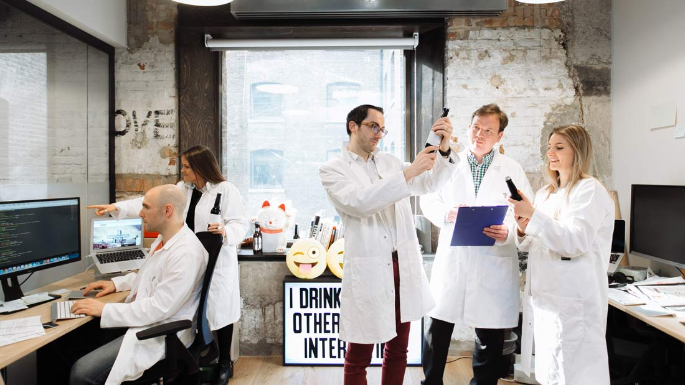
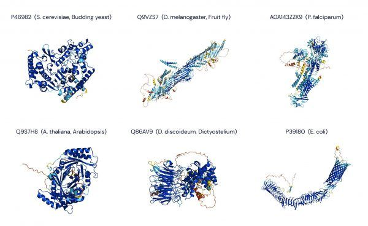

## Actividad N°1

#### Analizar y responder las siguientes preguntas

1. Buscar dos ejemplos de aplicaciones de inteligencia artificial

2. ¿Qué entiende por inteligencia artificial?

3. ¿Qué entiende por inteligencia?

4. ¿Qué entiende por artificial?

---

#### **Respuestas**

1. Dos aplicaciones de inteligencia artificial que encontré en internet y me llamaron la atención son:

    - **INTELLIGENTX AI BEER**: Se trata de una inteligencia artifical creada para perfeccionar la receta de distintas cervezas. La inteligencia se alimentaba de las opiniones de personas que probaban las cervezas y daban sus opiniones a un bot de facebook messenger. Los datos luego pasaban por sistema de aprendizaje por refuerzo, que mejoraba la receta y el procedimiento de preparación de cada variante según los aspectos que hubieran resultado positivos y negativos en los ensayos.

    

    - **AlphaFold**: Es un programa de inteligencia artificial desarrollado por DeepMind de Alphabets/Google que realiza predicciones de la estructura de las proteínas​ mediante el sistema de aprendizaje profundo, se ha utilizado para predecir varias estructuras de proteínas del SARS-CoV-2, el agente causante de la COVID-19. AlphaFold no deduce la estructura tridimensional de las proteínas a partir de sus propiedades fisicoquímicas. Lo que hace es comparar, mediante aprendizaje profundo haciendo uso de una red neuronal artificial, estructuras y secuencias de aminoácidos para las ciento setenta mil proteínas para las que se cuenta con el conocimiento necesario. Y a partir de esa comparación es capaz de predecir la forma de proteínas cuya estructura se desconoce, pero de las que se sabe su secuencia.

    

2. La inteligencia artificial entiendo que son un conjunto de reglas lógicas y algoritmos que permiten a una computadora inferir conocimiento o información a traves del analisis o alimentación de esa inteligencia con un conjunto de premisas y datos que existían previamente. A diferencia de la "inteligencia humana" su motor de inferencia no se ve alterado por emociones.

3. Entiendo como inteligencia a la capacidad de razonar, entender, inferir conocimiento, ser creativo y tener criterio para tomar decisiones. En el caso de la "inteligencia humana" entiendo que tambien se tiene la capacidad de entender estados emocionales y la empatía.

4. Entiendo como artificial algo que no es natural u orgánico. Tambien lo podría definir como algo creado por un ser racional.