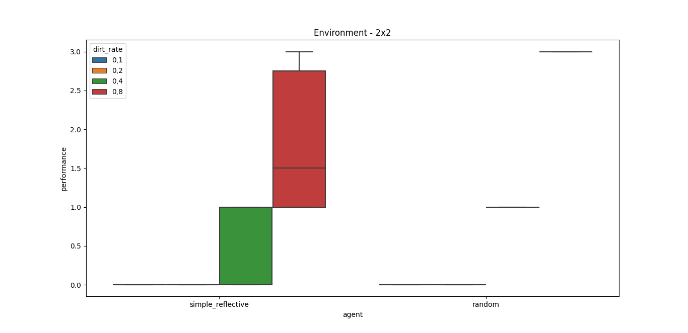
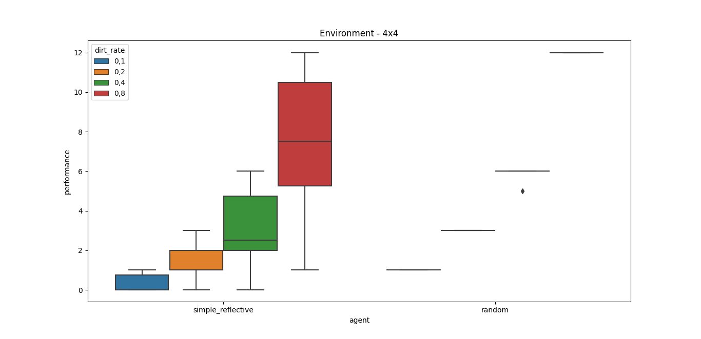
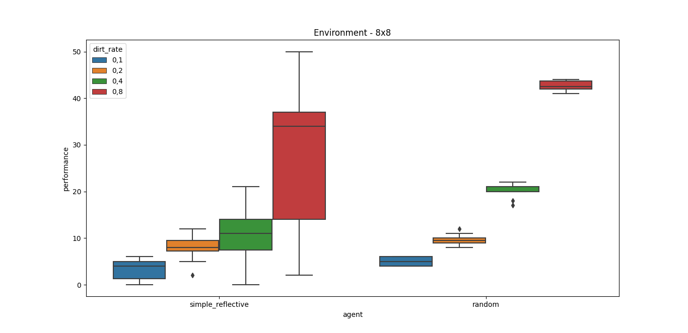
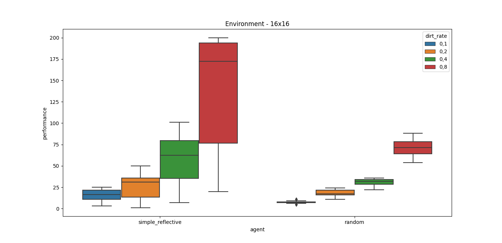
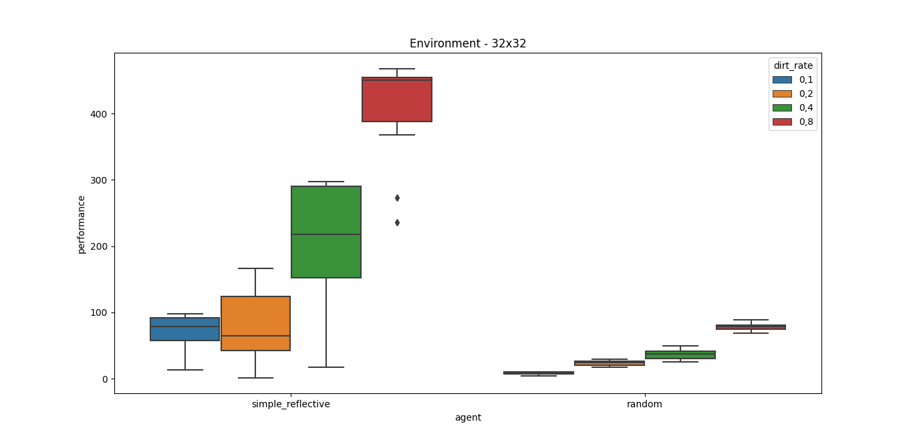
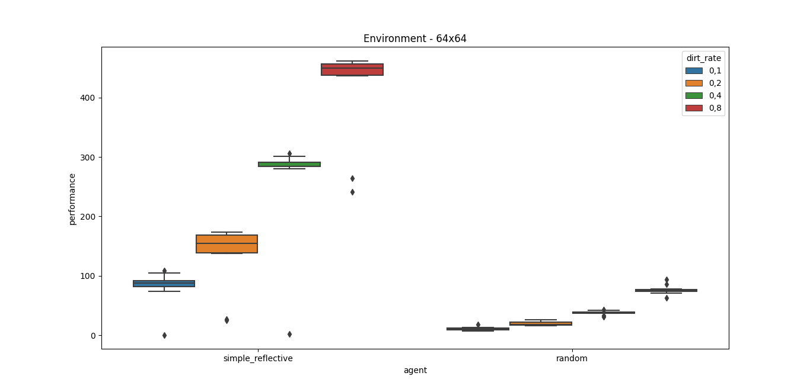
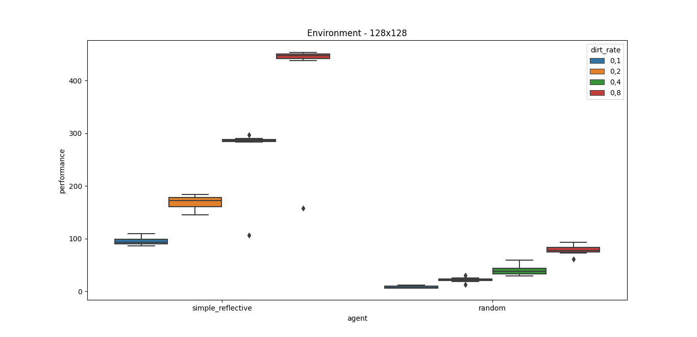

## Resultados de performance por tamaño de entorno y porcentaje de tierra

### *Entorno 2x2*

|agent|dirt\_rate|performance|
| - | - | - |
|||||
|simple\_reflective|0,1|0||
|random|0,1|0||
|simple\_reflective|0,1|0||
|random|0,1|0||
|simple\_reflective|0,1|0||
|random|0,1|0||
|simple\_reflective|0,1|0||
|random|0,1|0||
|simple\_reflective|0,1|0||
|random|0,1|0||
|simple\_reflective|0,1|0||
|random|0,1|0||
|simple\_reflective|0,1|0||
|random|0,1|0||
|simple\_reflective|0,1|0||
|random|0,1|0||
|simple\_reflective|0,1|0||
|random|0,1|0||
|simple\_reflective|0,1|0||
|random|0,1|0||
|||||
|simple\_reflective|0,2|0||
|random|0,2|0||
|simple\_reflective|0,2|0||
|random|0,2|0||
|simple\_reflective|0,2|0||
|random|0,2|0||
|simple\_reflective|0,2|0||
|random|0,2|0||
|simple\_reflective|0,2|0||
|random|0,2|0||
|simple\_reflective|0,2|0||
|random|0,2|0||
|simple\_reflective|0,2|0||
|random|0,2|0||
|simple\_reflective|0,2|0||
|random|0,2|0||
|simple\_reflective|0,2|0||
|random|0,2|0||
|simple\_reflective|0,2|0||
|random|0,2|0||
|||||
|simple\_reflective|0,4|1||
|random|0,4|1||
|simple\_reflective|0,4|0||
|random|0,4|1||
|simple\_reflective|0,4|1||
|random|0,4|1||
|simple\_reflective|0,4|1||
|random|0,4|1||

|simple\_reflective|0,4|0||
| - | - | - | - |
|random|0,4|1||
|simple\_reflective|0,4|0||
|random|0,4|1||
|simple\_reflective|0,4|1||
|random|0,4|1||
|simple\_reflective|0,4|1||
|random|0,4|1||
|simple\_reflective|0,4|1||
|random|0,4|1||
|simple\_reflective|0,4|0||
|random|0,4|1||
|||||
|simple\_reflective|0,8|1||
|random|0,8|3||
|simple\_reflective|0,8|1||
|random|0,8|3||
|simple\_reflective|0,8|2||
|random|0,8|3||
|simple\_reflective|0,8|1||
|random|0,8|3||
|simple\_reflective|0,8|1||
|random|0,8|3||
|simple\_reflective|0,8|1||
|random|0,8|3||
|simple\_reflective|0,8|3||
|random|0,8|3||
|simple\_reflective|0,8|2||
|random|0,8|3||
|simple\_reflective|0,8|3||
|random|0,8|3||
|simple\_reflective|0,8|3||
|random|0,8|3||

### *Entorno 4x4*

|agent|dirt\_rate|performance|
| - | - | - |
|simple\_reflective|0,1|1||
|random|0,1|1||
|simple\_reflective|0,1|1||
|random|0,1|1||
|simple\_reflective|0,1|0||
|random|0,1|1||
|simple\_reflective|0,1|1||
|random|0,1|1||
|simple\_reflective|0,1|0||
|random|0,1|1||
|simple\_reflective|0,1|0||
|random|0,1|1||
|simple\_reflective|0,1|0||
|random|0,1|1||
|simple\_reflective|0,1|0||
|random|0,1|1||
|simple\_reflective|0,1|0||
|random|0,1|1||
|simple\_reflective|0,1|0||
|random|0,1|1||
|||||
|simple\_reflective|0,2|1||
|random|0,2|3||
|simple\_reflective|0,2|1||
|random|0,2|3||
|simple\_reflective|0,2|2||
|random|0,2|3||
|simple\_reflective|0,2|3||
|random|0,2|3||
|simple\_reflective|0,2|1||
|random|0,2|3||
|simple\_reflective|0,2|0||
|random|0,2|3||
|simple\_reflective|0,2|2||
|random|0,2|3||
|simple\_reflective|0,2|1||
|random|0,2|3||
|simple\_reflective|0,2|1||
|random|0,2|3||
|simple\_reflective|0,2|2||
|random|0,2|3||
|||||
|simple\_reflective|0,4|0||
|random|0,4|6||
|simple\_reflective|0,4|6||
|random|0,4|6||
|simple\_reflective|0,4|2||
|random|0,4|6||
|simple\_reflective|0,4|2||
|random|0,4|6||
|simple\_reflective|0,4|2||

|random|0,4|6||
| - | - | - | - |
|simple\_reflective|0,4|5||
|random|0,4|6||
|simple\_reflective|0,4|4||
|random|0,4|6||
|simple\_reflective|0,4|5||
|random|0,4|5||
|simple\_reflective|0,4|1||
|random|0,4|6||
|simple\_reflective|0,4|3||
|random|0,4|6||
|||||
|simple\_reflective|0,8|9||
|random|0,8|12||
|simple\_reflective|0,8|6||
|random|0,8|12||
|simple\_reflective|0,8|11||
|random|0,8|12||
|simple\_reflective|0,8|12||
|random|0,8|12||
|simple\_reflective|0,8|9||
|random|0,8|12||
|simple\_reflective|0,8|1||
|random|0,8|12||
|simple\_reflective|0,8|2||
|random|0,8|12||
|simple\_reflective|0,8|11||
|random|0,8|12||
|simple\_reflective|0,8|6||
|random|0,8|12||
|simple\_reflective|0,8|5||
|random|0,8|12||

### *Entorno 8x8*

|agent|dirt\_rate|performance|
| - | - | - |
|simple\_reflective|0,1|2||
|random|0,1|4||
|simple\_reflective|0,1|1||
|random|0,1|6||
|simple\_reflective|0,1|5||
|random|0,1|6||
|simple\_reflective|0,1|1||
|random|0,1|6||
|simple\_reflective|0,1|5||
|random|0,1|6||
|simple\_reflective|0,1|6||
|random|0,1|4||
|simple\_reflective|0,1|0||
|random|0,1|4||
|simple\_reflective|0,1|3||
|random|0,1|4||
|simple\_reflective|0,1|5||
|random|0,1|6||
|simple\_reflective|0,1|6||
|random|0,1|4||
|||||
|simple\_reflective|0,2|2||
|random|0,2|10||
|simple\_reflective|0,2|10||
|random|0,2|10||
|simple\_reflective|0,2|8||
|random|0,2|9||
|simple\_reflective|0,2|11||
|random|0,2|9||
|simple\_reflective|0,2|7||
|random|0,2|10||
|simple\_reflective|0,2|12||
|random|0,2|11||
|simple\_reflective|0,2|8||
|random|0,2|12||
|simple\_reflective|0,2|5||
|random|0,2|8||
|simple\_reflective|0,2|8||
|random|0,2|9||
|simple\_reflective|0,2|8||
|random|0,2|9||
|||||
|simple\_reflective|0,4|21||
|random|0,4|22||
|simple\_reflective|0,4|13||
|random|0,4|20||
|simple\_reflective|0,4|9||
|random|0,4|22||
|simple\_reflective|0,4|14||
|random|0,4|20||
|simple\_reflective|0,4|14||

|random|0,4|20||
| - | - | - | - |
|simple\_reflective|0,4|7||
|random|0,4|17||
|simple\_reflective|0,4|9||
|random|0,4|21||
|simple\_reflective|0,4|6||
|random|0,4|21||
|simple\_reflective|0,4|19||
|random|0,4|20||
|simple\_reflective|0,4|0||
|random|0,4|18||
|||||
|simple\_reflective|0,8|2||
|random|0,8|43||
|simple\_reflective|0,8|39||
|random|0,8|42||
|simple\_reflective|0,8|23||
|random|0,8|42||
|simple\_reflective|0,8|32||
|random|0,8|44||
|simple\_reflective|0,8|36||
|random|0,8|44||
|simple\_reflective|0,8|37||
|random|0,8|43||
|simple\_reflective|0,8|37||
|random|0,8|42||
|simple\_reflective|0,8|50||
|random|0,8|42||
|simple\_reflective|0,8|9||
|random|0,8|44||
|simple\_reflective|0,8|11||
|random|0,8|41||

### *Entorno 16x16*

|agent|dirt\_rate|performance|
| - | - | - |
|simple\_reflective|0,1|4||
|random|0,1|9||
|simple\_reflective|0,1|16||
|random|0,1|6||
|simple\_reflective|0,1|9||
|random|0,1|8||
|simple\_reflective|0,1|24||
|random|0,1|8||
|simple\_reflective|0,1|3||
|random|0,1|7||
|simple\_reflective|0,1|17||
|random|0,1|7||
|simple\_reflective|0,1|16||
|random|0,1|5||
|simple\_reflective|0,1|23||
|random|0,1|7||
|simple\_reflective|0,1|25||
|random|0,1|7||
|simple\_reflective|0,1|17||
|random|0,1|11||
|||||
|simple\_reflective|0,2|3||
|random|0,2|16||
|simple\_reflective|0,2|36||
|random|0,2|24||
|simple\_reflective|0,2|35||
|random|0,2|18||
|simple\_reflective|0,2|1||
|random|0,2|17||
|simple\_reflective|0,2|33||
|random|0,2|20||
|simple\_reflective|0,2|50||
|random|0,2|15||
|simple\_reflective|0,2|29||
|random|0,2|11||
|simple\_reflective|0,2|14||
|random|0,2|16||
|simple\_reflective|0,2|49||
|random|0,2|22||
|simple\_reflective|0,2|13||
|random|0,2|24||
|||||
|simple\_reflective|0,4|65||
|random|0,4|32||
|simple\_reflective|0,4|101||
|random|0,4|30||
|simple\_reflective|0,4|52||
|random|0,4|35||
|simple\_reflective|0,4|60||
|random|0,4|32||
|simple\_reflective|0,4|7||
|random|0,4|36||
| - | - | - | - |
|simple\_reflective|0,4|70||
|random|0,4|28||
|simple\_reflective|0,4|25||
|random|0,4|32||
|simple\_reflective|0,4|30||
|random|0,4|22||
|simple\_reflective|0,4|83||
|random|0,4|28||
|simple\_reflective|0,4|87||
|random|0,4|36||
|||||
|simple\_reflective|0,8|200||
|random|0,8|68||
|simple\_reflective|0,8|199||
|random|0,8|88||
|simple\_reflective|0,8|84||
|random|0,8|72||
|simple\_reflective|0,8|195||
|random|0,8|79||
|simple\_reflective|0,8|156||
|random|0,8|59||
|simple\_reflective|0,8|189||
|random|0,8|79||
|simple\_reflective|0,8|61||
|random|0,8|54||
|simple\_reflective|0,8|190||
|random|0,8|63||
|simple\_reflective|0,8|20||
|random|0,8|77||
|simple\_reflective|0,8|74||
|random|0,8|71||

### *Entorno 32x32*

|agent|dirt\_rate|performance|
| - | - | - |
|simple\_reflective|0,1|54||
|random|0,1|10||
|simple\_reflective|0,1|91||
|random|0,1|10||
|simple\_reflective|0,1|98||
|random|0,1|4||
|simple\_reflective|0,1|94||
|random|0,1|10||
|simple\_reflective|0,1|13||
|random|0,1|7||
|simple\_reflective|0,1|85||
|random|0,1|7||
|simple\_reflective|0,1|92||
|random|0,1|6||
|simple\_reflective|0,1|72||
|random|0,1|9||
|simple\_reflective|0,1|50||
|random|0,1|7||
|simple\_reflective|0,1|68||
|random|0,1|10||
|||||
|simple\_reflective|0,2|125||
|random|0,2|25||
|simple\_reflective|0,2|51||
|random|0,2|26||
|simple\_reflective|0,2|122||
|random|0,2|26||
|simple\_reflective|0,2|8||
|random|0,2|20||
|simple\_reflective|0,2|42||
|random|0,2|21||
|simple\_reflective|0,2|79||
|random|0,2|24||
|simple\_reflective|0,2|1||
|random|0,2|26||
|simple\_reflective|0,2|42||
|random|0,2|29||
|simple\_reflective|0,2|166||
|random|0,2|17||
|simple\_reflective|0,2|164||
|random|0,2|19||
|||||
|simple\_reflective|0,4|17||
|random|0,4|40||
|simple\_reflective|0,4|228||
|random|0,4|32||
|simple\_reflective|0,4|297||
|random|0,4|49||
|simple\_reflective|0,4|291||
|random|0,4|42||
|simple\_reflective|0,4|164||
|random|0,4|42||
| - | - | - | - |
|simple\_reflective|0,4|207||
|random|0,4|29||
|simple\_reflective|0,4|54||
|random|0,4|39||
|simple\_reflective|0,4|148||
|random|0,4|36||
|simple\_reflective|0,4|286||
|random|0,4|27||
|simple\_reflective|0,4|294||
|random|0,4|25||
|||||
|simple\_reflective|0,8|368||
|random|0,8|79||
|simple\_reflective|0,8|448||
|random|0,8|76||
|simple\_reflective|0,8|455||
|random|0,8|81||
|simple\_reflective|0,8|468||
|random|0,8|69||
|simple\_reflective|0,8|236||
|random|0,8|78||
|simple\_reflective|0,8|450||
|random|0,8|81||
|simple\_reflective|0,8|273||
|random|0,8|85||
|simple\_reflective|0,8|451||
|random|0,8|89||
|simple\_reflective|0,8|461||
|random|0,8|73||
|simple\_reflective|0,8|452||
|random|0,8|74||

### *Entorno 64x64*

|agent|dirt\_rate|performance|
| - | - | - |
|simple\_reflective|0,1|0||
|random|0,1|10||
|simple\_reflective|0,1|109||
|random|0,1|9||
|simple\_reflective|0,1|89||
|random|0,1|12||
|simple\_reflective|0,1|88||
|random|0,1|7||
|simple\_reflective|0,1|105||
|random|0,1|8||
|simple\_reflective|0,1|80||
|random|0,1|13||
|simple\_reflective|0,1|93||
|random|0,1|9||
|simple\_reflective|0,1|87||
|random|0,1|18||
|simple\_reflective|0,1|74||
|random|0,1|10||
|simple\_reflective|0,1|87||
|random|0,1|11||
|||||
|simple\_reflective|0,2|138||
|random|0,2|16||
|simple\_reflective|0,2|163||
|random|0,2|26||
|simple\_reflective|0,2|146||
|random|0,2|18||
|simple\_reflective|0,2|167||
|random|0,2|17||
|simple\_reflective|0,2|173||
|random|0,2|20||
|simple\_reflective|0,2|27||
|random|0,2|24||
|simple\_reflective|0,2|170||
|random|0,2|17||
|simple\_reflective|0,2|169||
|random|0,2|17||
|simple\_reflective|0,2|140||
|random|0,2|16||
|simple\_reflective|0,2|25||
|random|0,2|23||
|||||
|simple\_reflective|0,4|284||
|random|0,4|37||
|simple\_reflective|0,4|2||
|random|0,4|43||
|simple\_reflective|0,4|292||
|random|0,4|39||
|simple\_reflective|0,4|306||
|random|0,4|42||
|simple\_reflective|0,4|288||
|random|0,4|31||
| - | - | - | - |
|simple\_reflective|0,4|284||
|random|0,4|38||
|simple\_reflective|0,4|284||
|random|0,4|38||
|simple\_reflective|0,4|301||
|random|0,4|39||
|simple\_reflective|0,4|285||
|random|0,4|37||
|simple\_reflective|0,4|280||
|random|0,4|33||
|||||
|simple\_reflective|0,8|457||
|random|0,8|71||
|simple\_reflective|0,8|454||
|random|0,8|75||
|simple\_reflective|0,8|461||
|random|0,8|73||
|simple\_reflective|0,8|440||
|random|0,8|78||
|simple\_reflective|0,8|446||
|random|0,8|75||
|simple\_reflective|0,8|241||
|random|0,8|63||
|simple\_reflective|0,8|457||
|random|0,8|94||
|simple\_reflective|0,8|264||
|random|0,8|75||
|simple\_reflective|0,8|437||
|random|0,8|86||
|simple\_reflective|0,8|462||
|random|0,8|75||

### *Entorno 128x128*

|agent|dirt\_rate|performance|
| - | - | - |
|simple\_reflective|0,1|94||
|random|0,1|8||
|simple\_reflective|0,1|91||
|random|0,1|6||
|simple\_reflective|0,1|100||
|random|0,1|12||
|simple\_reflective|0,1|105||
|random|0,1|6||
|simple\_reflective|0,1|90||
|random|0,1|6||
|simple\_reflective|0,1|88||
|random|0,1|6||
|simple\_reflective|0,1|86||
|random|0,1|7||
|simple\_reflective|0,1|97||
|random|0,1|12||
|simple\_reflective|0,1|109||
|random|0,1|7||
|simple\_reflective|0,1|92||
|random|0,1|10||
|||||
|simple\_reflective|0,2|184||
|random|0,2|23||
|simple\_reflective|0,2|183||
|random|0,2|21||
|simple\_reflective|0,2|157||
|random|0,2|22||
|simple\_reflective|0,2|145||
|random|0,2|13||
|simple\_reflective|0,2|178||
|random|0,2|30||
|simple\_reflective|0,2|170||
|random|0,2|19||
|simple\_reflective|0,2|177||
|random|0,2|25||
|simple\_reflective|0,2|149||
|random|0,2|21||
|simple\_reflective|0,2|175||
|random|0,2|23||
|simple\_reflective|0,2|170||
|random|0,2|20||
|||||
|simple\_reflective|0,4|283||
|random|0,4|35||
|simple\_reflective|0,4|284||
|random|0,4|59||
|simple\_reflective|0,4|288||
|random|0,4|37||
|simple\_reflective|0,4|297||
|random|0,4|29||
|simple\_reflective|0,4|289||
|random|0,4|31||
| - | - | - | - |
|simple\_reflective|0,4|290||
|random|0,4|38||
|simple\_reflective|0,4|286||
|random|0,4|32||
|simple\_reflective|0,4|287||
|random|0,4|44||
|simple\_reflective|0,4|107||
|random|0,4|47||
|simple\_reflective|0,4|284||
|random|0,4|41||
|||||
|simple\_reflective|0,8|454||
|random|0,8|90||
|simple\_reflective|0,8|448||
|random|0,8|93||
|simple\_reflective|0,8|158||
|random|0,8|83||
|simple\_reflective|0,8|440||
|random|0,8|61||
|simple\_reflective|0,8|454||
|random|0,8|73||
|simple\_reflective|0,8|451||
|random|0,8|74||
|simple\_reflective|0,8|451||
|random|0,8|83||
|simple\_reflective|0,8|438||
|random|0,8|77||
|simple\_reflective|0,8|448||
|random|0,8|78||
|simple\_reflective|0,8|447||
|random|0,8|76||

