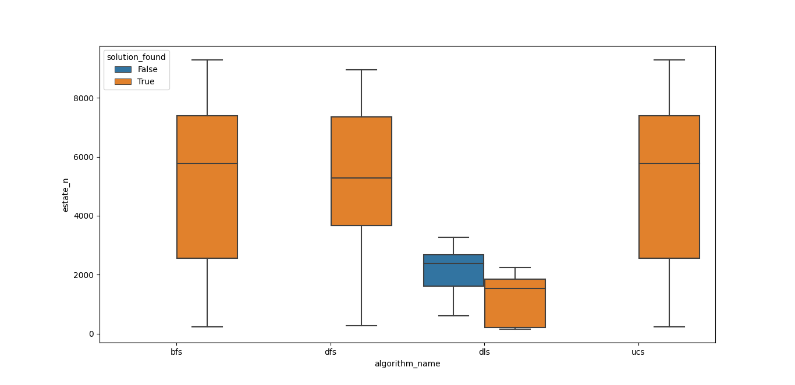

## Trabajo Práctico N° 3
### Búsqueda no informada

B)
#### A continuación se presentan los resultados de las simulaciones correspondientes a los algoritmos de búsqueda no informada.

|   Algoritmo   |   Media       |    Desviación estándar     |
| :-----------: | :-----------: |  :--------------------:    |
|   BFS         |    5140.73    |          2673.19           |                          
|   DFS         |    5279.03    |          2344.01           |                          
|   DLS         |    1211.55    |           799.36           |                          
|   UCS         |    5139.73    |          2673.19           |                          

**\*La media y desviación estándar del algoritmo DLS se ven afectadas por la cantidad de iteraciones en las que no llegó a encontrar solución. Se definió un limite de 100 para el mismo**

C)
    De los resultados obtenidos puedo concluir que si bien el algoritmo que menos estados recorre antes de encontrar la solución es el DLS, hay un número significativo de veces en las que no encuentra solución por estar más allá del limite definido. Los algoritmos BFS y UCS tienen una performance muy parecida, y a pesar de tener resultados más dispersos que el DFS, considero que son los más eficientes de los aloritmos utilizados para el problema planteado en este práctico.