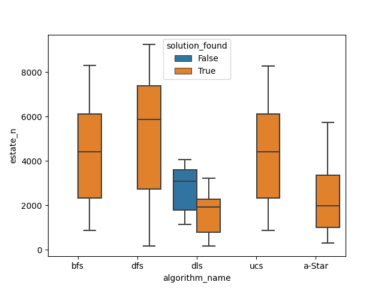

## Trabajo Práctico N° 4
### Búsqueda informada

B)
#### A continuación se presentan los resultados de las simulaciones correspondientes a los algoritmos de búsqueda informada.

|   Algoritmo   |   Media       |    Desviación estándar     |
| :-----------: | :-----------: |  :--------------------:    |
|   BFS         |    4453.90    |          2225.45           |                          
|   DFS         |    5286.00    |          2874.25           |                          
|   DLS         |    1633.81    |          1025.67           |                          
|   UCS         |    4452.90    |          2225.45           |
|   A-star      |    2377.73    |          1552.69           |                           

**\*La media y desviación estándar del algoritmo DLS se ven afectadas por la cantidad de iteraciones en las que no llegó a encontrar solución. Se definió un limite de 100 para el mismo**

