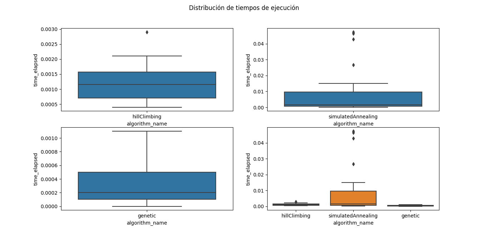
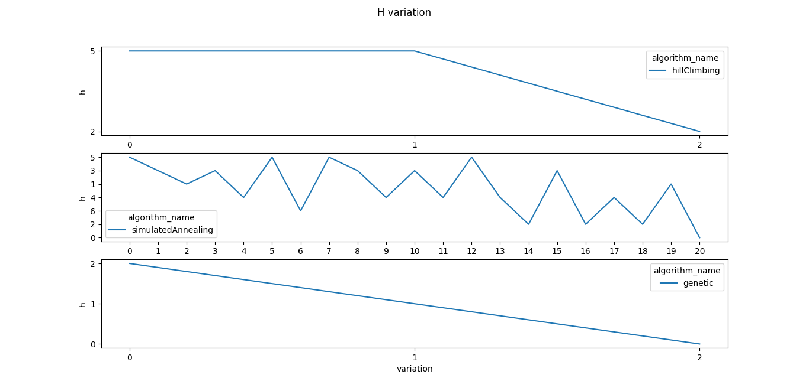
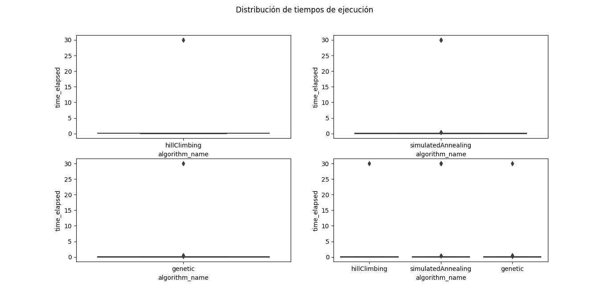
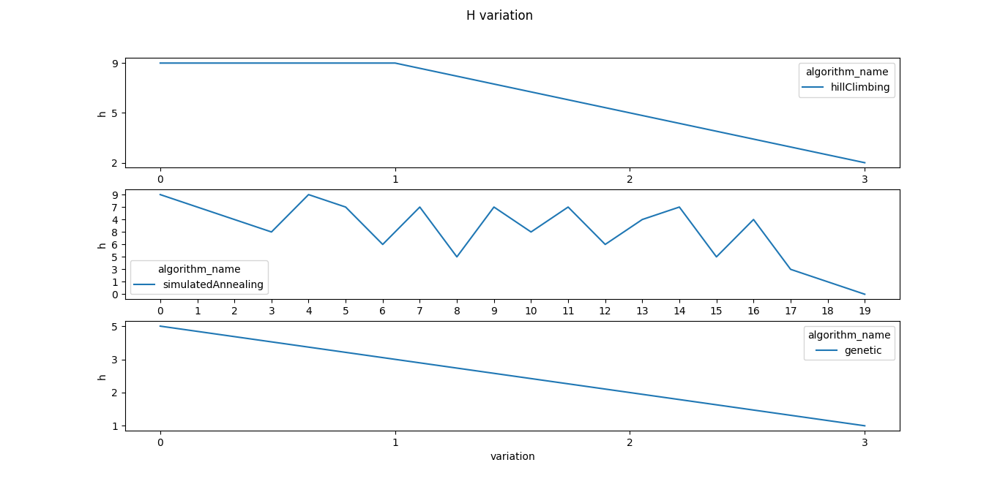
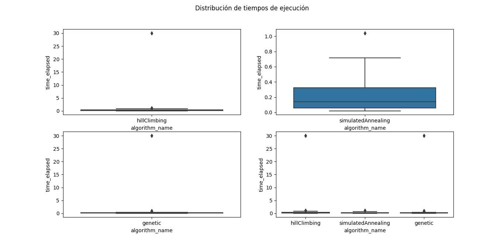
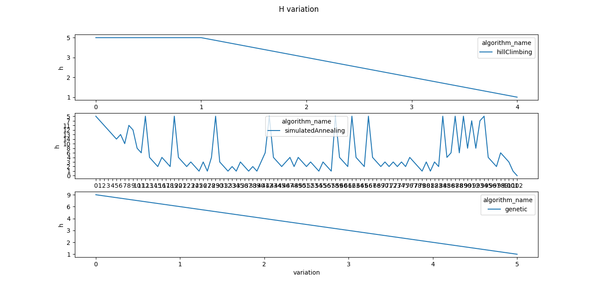

##  Datos del algoritmo 'Hill Climbing':

   Reinas   |    Porcentaje de estados óptimos alcanzados    |   Media de estados recorridos |   Media de tiempos de ejecución   |   Desviación estándar de estados recorridos   |Desviación estándar de tiempos de ejecución    |
   |    ----------  |    ----------  |   ------------    |   ------------    |   ------------    |   -------------   |
   |    4   |    100.0  |  3.13333   |     0.00123   | 0.77608  |   0.00059  |
   |    8   |   96.67   |   10.06667    |   1.03695    |   4.13508    |   5.4704
   |    10  |  96.67  |   24.63333    |   1.2703     |   22.01016    |   5.43528

##  Datos del algoritmo 'Simulated Annealing':

   Reinas   |    Porcentaje de estados óptimos alcanzados    |   Media de estados recorridos |   Media de tiempos de ejecución   |   Desviación estándar de estados recorridos   |Desviación estándar de tiempos de ejecución    |
   |    ----------  |    ----------  |   ------------    |   ------------    |   ------------    |   -------------   |
   |    4   |    100.0  |  24.56667   |     0.00846   | 11.49118  |   0.01384  |
   |    8   |   90.0   |   17.4    |   3.05916     |   9.96753    |   9.13443
   |    10  |  100.0  |   44.96667    |   0.23566     |   33.3575    |   5.44461

##   Datos del algoritmo 'Genetic':

   Reinas   |    Porcentaje de estados óptimos alcanzados    |   Media de estados recorridos |   Media de tiempos de ejecución   |   Desviación estándar de estados recorridos   |Desviación estándar de tiempos de ejecución    |
   |    ----------  |    ----------  |   ------------    |   ------------    |   ------------    |   -------------   |
   |    4   |    100.0   |   15.8    |     0.00038   | 16.42832   |  0.00034  |
   |    8   |   96.67   |   24.9    |   1.07079    |   14.75162    |   5.46466
   |    10  |   96.67   |   62.43333    |   1.19812     |   36.40546    |   7.58592

### 4 Reinas

### 8 Reinas

### 10 Reinas

El algoritmo que considero más adecuado para la resolución de este problema es el simulated annealing, ya que si bien tiene más fluctuaciones en su medida de fitness gracias a la probabilidad de aceptar estados "peores", no se queda atascado en mínimos locales como el Hill climbing, y la convergencia al estado óptimo del algoritmo funciona mejor en este caso que el cruce y la mutación del algoritmo genético, que no siempre llega al estado óptimo de la solución y necesita de más cruces para acercarse al mejor estado posible.