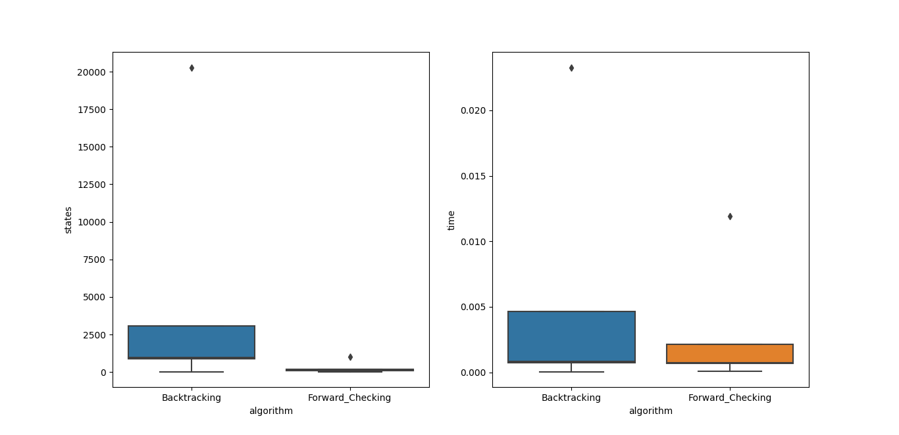

### 1-  

    Variables: Cada celda vacía del tablero

    Dominio: El conjunto de números del 1 al 9

    Restricciones: Los números no se pueden repetir en ninguna fila, columna o submatriz

### 2- 

### *Solución parcial {WA = Rojo, V = Azul}*

Asignación inicial:

|   WA  |   NT  |   SA  |   Q   |   NSW    |    V   |   T   |
|  :----: |   :---: |   :---: |   :---: |   :---:    |   :---:  |   :---:     |
|   R   |   R/V/A |   R/V/A |   R/V/A |   R/V/A   |    A   |    R/V/A   |

Por arco de consistencia de NT con WA y SA con WA, se elimina el color rojo en ambas para mantener la consistencia, y por arco de consistencia de NSW con V y SA con V, se elimina azul de ambas.

|   WA  |   NT  |   SA  |   Q   |   NSW    |    V   |   T   |
|  :----: |   :---: |   :---: |   :---: |   :---:    |   :---:  |   :---:     |
|   R   |   V/A |   V |   R/V/A |   R/V    |    A   | R/V/A   |

Por arco consistencia de NT, Q y NSW con SA, se elimina verde de las tres.

|   WA  |   NT  |   SA  |   Q   |   NSW    |    V   |   T   |
|  :----: |   :---: |   :---: |   :---: |   :---:    |   :---:  |   :---:     |
|   R   |   A |   V |   R/A |   R    |    A   | R/V/A   |

Por arco de consistencia Q con NT y NSW se elimina rojo y azul de Q, dejando Q sin valores posibles.

|   WA  |   NT  |   SA  |   Q   |   NSW    |    V   |   T   |
|  :----: |   :---: |   :---: |   :---: |   :---:    |   :---:  |   :---:     |
|   R   |   A |   V |  -  |   R    |    A   | R/V/A   |

Y queda demostrado así que se puede detectar la inconsistencia de la solución parcial {WA = Rojo, V = Azul} utilizando arco consistencia.

### 3- 

Si usaramos árboles estructurados, el algoritmo AC-3 que tiene una complejidad inicial de O(n^2*d^2) se ve reducida a O(n*d^2), ya que se verían reducidas la cantidad de aristas hasta formar una lista, que tiene orden O(n).

### 4-

Si cada vez que se suprime un posible valor de Xi se tiene que encolar nuevamente el arco (Xk,Xi) entonces cada arco se puede añadir un máximo de d veces, si preprocesamos las restricciones del problema, tal que un valor de Xi, se conoce cuáles son los valores de Xk que conforman el arco de consistencia con ese valor de Xi, podría hacerse la comprobación de consistencia de un arco en O(d), dejando la complejidad temporal del problema en O(n^2*d^2).

5-
   
a)  Se puede demostrar que **para un CSP cuyo grafo de restricciones es un árbol, 2-consistencia implica n-consistencia** de la siguiente manera:

    i-  Se elige cualquier variable como raíz y se ordena de modo que el padre de cada nodo lo preceda en el orden.
    ii- Para todas las variable se aplica consistencia de arco (Xi,Xj) donde Xi es el padre de Xj, quitando los valores del dominio según corresponda.
    iii- Para j desde 1 hasta n, se asigna cualquier valor de Xj consistente con el valor asignado d a su padre.

Después del paso **ii-**, el CSP tiene 2-consistencia, por lo que la asignación del paso **iii-** no requiere ninguna vuelta atrás, y aplicando la comprobación de consistencia de arco en orden inverso al paso **ii-**, nos aseguramos de que cualquier valor suprimido no afecte la consistencia de los arcos que ya han sido tratados, asegurando la n-consistencia.

b)  Ya que todos los CSP para árboles estructurados se pueden ordenar del modo explicado, y comprobando la consistencia de arco en el orden mostrado asegura que el problema se podrá resolver ya que se garantiza la n-consistencia.

6)

