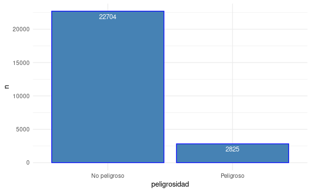
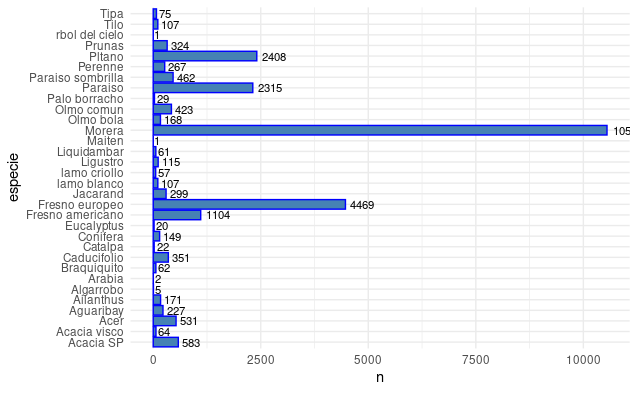
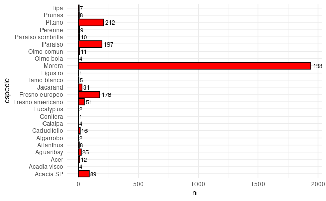
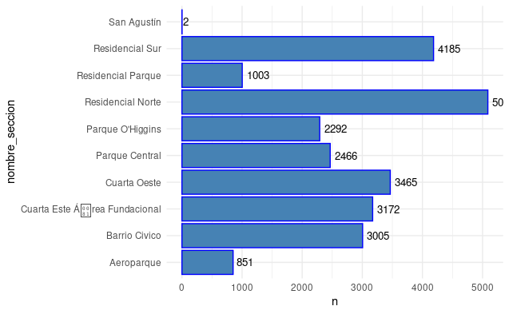
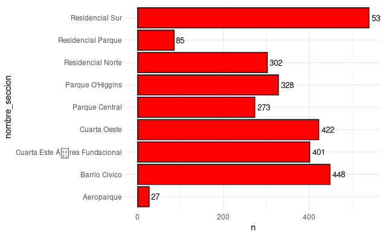
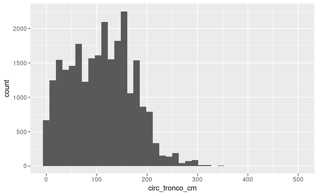
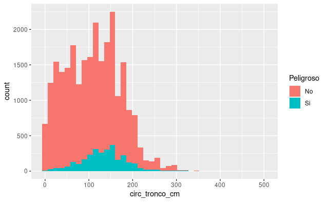

## Ejercicio 2

### Distribución Inclinación Peligrosa

### Arboles por especie

### Arboles peligrosos por especie

### Cantidad de arboles por sección

Si bien, hay una marcada diferencia en la especie Morera en cuanto a la cantidad de Moreras con inclinación peligrosa que hay, hay que tener en cuenta que es por lejos el arbol con mayor numero de ejemplares en el dataset, por lo que no sería correcto afirmar a priori que es la especie más peligrosa.

### Arboles con inclinación peligrosa por sección

La sección con más arboles con inclinacion peligrosa es la Residencial Sur, pero hay que tener en cuenta el total de arboles por sección para afirmar cual sección es más peligrosa.

## Ejercicio 3

Despues de probar con varios numeros de bins, se decidió utilizar cortes con bins=40, ya que quedaban más marcadas las clases por circunferencia de tronco de los arboles.

### Resultados con bins=40

