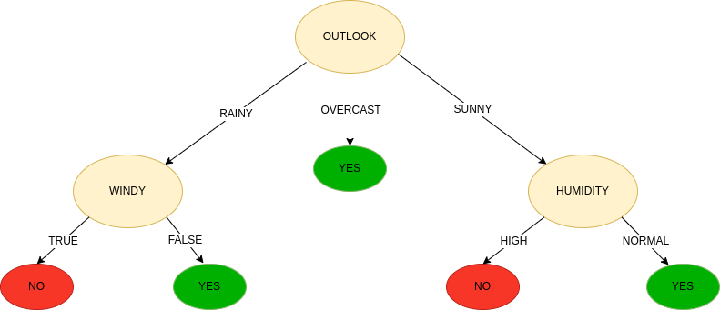

### Dataset

|outlook|temp|humidity|windy|play|
|:----|:----|:----|:----|:----|
|sunny|hot|high|false|no|
|sunny|hot|high|true|no|
|overcast|hot|high|false|yes|
|rainy|mild|high|false|yes|
|rainy|cool|normal|false|yes|
|rainy|cool|normal|true|no|
|overcast|cool|normal|true|yes|
|sunny|mild|high|false|no|
|sunny|cool|normal|false|yes|
|rainy|mild|normal|false|yes|
|sunny|mild|normal|true|yes|
|overcast|mild|high|true|yes|
|overcast|hot|normal|false|yes|
|rainy|mild|high|true|no|

## Resultado obtenido

## Arboles para datos de tipo real

Los árboles de regresión son el subtipo de árboles de predicción que se aplica cuando la variable respuesta es continua. En términos generales, en el entrenamiento de un árbol de regresión, las observaciones se van distribuyendo por bifurcaciones (nodos) generando la estructura del árbol hasta alcanzar un nodo terminal. Cuando se quiere predecir una nueva observación, se recorre el árbol acorde al valor de sus predictores hasta alcanzar uno de los nodos terminales. La predicción del árbol es la media de la variable respuesta de las observaciones de entrenamiento que están en ese mismo nodo terminal.

### Entrenamiento del árbol

El proceso de entrenamiento de un árbol de predicción se divide en dos etapas:

    División sucesiva del espacio de los predictores generando regiones no solapantes (nodos terminales)  R1,  R2,  R3, ..., Rj . Aunque, desde el punto de vista teórico las regiones podrían tener cualquier forma, si se limitan a regiones rectangulares (de múltiples dimensiones), se simplifica en gran medida el proceso de construcción y se facilita la interpretación.

    Predicción de la variable respuesta en cada región.

A pesar de la sencillez con la que se puede resumir el proceso de construcción de un árbol, es necesario establecer una metodología que permita crear las regiones  R1 ,  R2 ,  R3, ..., Rj , o lo que es equivalente, decidir donde se introducen las divisiones: en que predictores y en que valores de los mismos.

En los árboles de regresión, el criterio empleado con más frecuencia para identificar las divisiones es el Residual Sum of Squares (RSS). El objetivo es buscar una distribución de regiones tal que, el sumatorio de las desviaciones al cuadrado entre las observaciones y la media de la región a la que pertenecen sea lo menor posible.

Desafortunadamente, no es posible considerar todas las posibles particiones del espacio de los predictores. Por esta razón, se recurre a lo que se conoce como recursive binary splitting (división binaria recursiva). Esta solución sigue la misma idea que la selección de predictores stepwise (backward o fordward) en regresión lineal múltiple, no evalúa todas las posibles regiones pero, alcanza un buen balance computación-resultado.